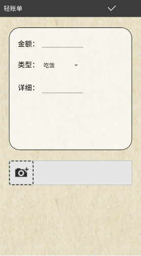

# 实验五：Android存储编程 #5

## 实验目标
 + 了解Andoid的存储手段
 + 掌握Android的文件存储
 + 掌握Android的数据库存储
## 实验内容一（选做1个）
根据选题要求使用文件存储
将应用产生的数据保存到文件存储中；
说明使用的文件存储方式：内部 or 外部；
将运行结果截图。
## 实验结果
```java
package com.example.pl.qzd;

import android.Manifest;
import android.annotation.TargetApi;
import android.app.ActionBar;
import android.content.ContentUris;
import android.content.Intent;
import android.content.pm.PackageManager;
import android.database.Cursor;
import android.graphics.Bitmap;
import android.graphics.BitmapFactory;
import android.net.Uri;
import android.os.Build;
import android.os.Bundle;
import android.provider.DocumentsContract;
import android.provider.MediaStore;
import android.support.annotation.NonNull;
import android.support.annotation.Nullable;
import android.support.v4.app.ActivityCompat;
import android.support.v4.content.ContextCompat;
import android.support.v4.content.FileProvider;
import android.support.v7.app.AppCompatActivity;
import android.util.TypedValue;
import android.view.MenuItem;
import android.view.View;
import android.view.ViewGroup;
import android.widget.AbsoluteLayout;
import android.widget.ImageButton;
import android.widget.ImageView;
import android.widget.PopupMenu;
import android.widget.Toast;

import com.example.aaa.net1714080903132.R;

import java.io.File;
import java.io.FileNotFoundException;
import java.io.IOException;

public class Tianjiajilu extends AppCompatActivity{

    ImageButton imageButton1;
    ImageButton imageButton2;
    ImageView imageView;


    private Uri uriImage;
    private File image;
    @Override
    protected void onCreate(@Nullable Bundle savedInstanceState) {
        super.onCreate(savedInstanceState);
        setContentView(R.layout.tianjiajilu);
        getSupportActionBar().hide();

        imageButton1 = findViewById(R.id.IB_5);
        imageButton2 = findViewById(R.id.IB_pz);
        imageView = findViewById(R.id.IV);
        imageButton1.setOnClickListener(new View.OnClickListener() {
            @Override
            public void onClick(View view) {
                finish();
            }
        });

        imageButton2.setOnClickListener(new View.OnClickListener() {
            @Override
            public void onClick(View view) {
                showOrderWayMenu(view);
            }
        });

    }
    private void showOrderWayMenu(View view){
        PopupMenu popupMenu=new PopupMenu(this,view);
        popupMenu.getMenuInflater().inflate(R.menu.menu,popupMenu.getMenu());
        popupMenu.setOnMenuItemClickListener(new PopupMenu.OnMenuItemClickListener() {
            @Override
            public boolean onMenuItemClick(MenuItem item) {
                if(item.getTitle().equals("拍照选择")){
                    image = new File(getExternalCacheDir(),"123.jpg");
                    try {
                        if(image.exists()){
                            image.delete();
                        }
                        image.createNewFile();
                    } catch (IOException e) {
                        e.printStackTrace();
                    }
                    if(Build.VERSION.SDK_INT >= 24){
                        uriImage = FileProvider.getUriForFile(Tianjiajilu.this, "comxf.activity.provider.download1", image);
                    }else{
                        uriImage = Uri.fromFile(image);
                    }
                    Intent intent = new Intent(MediaStore.ACTION_IMAGE_CAPTURE);
                    intent.putExtra(MediaStore.EXTRA_OUTPUT, uriImage);
                    startActivityForResult(intent, 1);
                }
                if(item.getTitle().equals("从相册中选择")){
                    if(ContextCompat.checkSelfPermission(Tianjiajilu.this,
                            Manifest.permission.WRITE_EXTERNAL_STORAGE) != PackageManager.PERMISSION_GRANTED){
                        ActivityCompat.requestPermissions(Tianjiajilu.this,
                                new String[]{Manifest.permission.WRITE_EXTERNAL_STORAGE},1);
                    }else{
                        openAlbum();
                    }
                }
                return false;
            }
        });
        popupMenu.show();
    }

    @Override
    protected void onActivityResult(int requestCode, int resultCode, @Nullable Intent data) {
        super.onActivityResult(requestCode, resultCode, data);
        switch (requestCode){
            case 1:
                if(resultCode == RESULT_OK){
                    try {
                        Bitmap bitmap = BitmapFactory.decodeStream(getContentResolver().openInputStream(uriImage));
                        imageView.setImageBitmap(bitmap);
                        ViewGroup.LayoutParams params;
                        params = imageView.getLayoutParams();
                        params.height = (int)TypedValue.applyDimension(TypedValue.COMPLEX_UNIT_DIP, 75, getResources().getDisplayMetrics());
                        params.width = (int)TypedValue.applyDimension(TypedValue.COMPLEX_UNIT_DIP, 75, getResources().getDisplayMetrics());
                        imageView.setLayoutParams(params);
                    } catch (FileNotFoundException e) {
                        e.printStackTrace();
                    }
                }break;
            case 2:
                if(resultCode == RESULT_OK){
                    if(Build.VERSION.SDK_INT >= 19){
                        handleImageOnKitKat(data);
                    }else{
                        handleImageBeforeKitKat(data);
                    }
                }break;
        }
    }
    private void openAlbum(){
        Intent intent = new Intent("android.intent.action.GET_CONTENT");
        intent.setType("image/*");//设置intent的接受类型为image图片类
        startActivityForResult(intent, 2);
    }
    @Override
    public void onRequestPermissionsResult(int requestCode, @NonNull String[] permissions, @NonNull int[] grantResults) {
        super.onRequestPermissionsResult(requestCode, permissions, grantResults);

        switch (requestCode){
            case 1:
                if(grantResults.length > 0 && grantResults[0] == PackageManager.PERMISSION_GRANTED){
                    openAlbum();
                }else{
                    Toast.makeText(this, "没有权限", Toast.LENGTH_SHORT).show();
                }break;
        }
    }
    @TargetApi(19)
    private void handleImageOnKitKat(Intent data){
        String imagepath = null;
        Uri uri = data.getData();
        if(DocumentsContract.isDocumentUri(this, uri)){     //判断是不是Documents类
            String docId  = DocumentsContract.getDocumentId(uri);
            if("com.android.providers.media.documents".equals(uri.getAuthority())){
                String id = docId.split(":")[1];
                String selection = MediaStore.Images.Media._ID + "=" + id;
                imagepath = getImagePath(MediaStore.Images.Media.EXTERNAL_CONTENT_URI, selection);
            }else if("com.android.providers.downloads.documents".equals(uri.getAuthority())){
                Uri contentUri = ContentUris.withAppendedId(Uri.parse("content://downloads/public_downloads"),
                        Long.valueOf(docId));//连接连个Uri
                imagepath = getImagePath(contentUri, null);
            }
        }else if("content".equalsIgnoreCase(uri.getScheme())){
            imagepath = getImagePath(uri, null);
        }else if("file".equalsIgnoreCase(uri.getScheme())){
            imagepath = uri.getPath();
        }
        displayImage(imagepath);
    }
    private void handleImageBeforeKitKat(Intent data){
        Uri uri = data.getData();
        String imagePath = getImagePath(uri, null);
        displayImage(imagePath);
    }

    private String getImagePath(Uri uri, String selection){
        String path = null;
        Cursor cursor = getContentResolver().query(uri, null, selection, null,null);
        if(cursor != null){
            if(cursor.moveToFirst()){
                path = cursor.getString(cursor.getColumnIndex(MediaStore.Images.Media.DATA));
            }
            cursor.close();
        }
        return path;
    }

    private void displayImage(String imagePath){
        if(imagePath != null){
            Bitmap bitmap = BitmapFactory.decodeFile(imagePath);
            imageView.setImageBitmap(bitmap);
            ViewGroup.LayoutParams params;
            params = imageView.getLayoutParams();
            params.height = (int)TypedValue.applyDimension(TypedValue.COMPLEX_UNIT_DIP, 75, getResources().getDisplayMetrics());
            params.width = (int)TypedValue.applyDimension(TypedValue.COMPLEX_UNIT_DIP, 75, getResources().getDisplayMetrics());
            imageView.setLayoutParams(params);
        }else{
            Toast.makeText(this, "找不到图片",Toast.LENGTH_SHORT).show();
        }
    }
}
——————————————————————————————————
<?xml version="1.0" encoding="utf-8"?>
<LinearLayout
    xmlns:android="http://schemas.android.com/apk/res/android"
    android:layout_width="match_parent"
    android:layout_height="match_parent"
    android:background="@drawable/bj"
    android:orientation="vertical">

    <LinearLayout
        android:layout_width="match_parent"
        android:layout_height="50dp"
        android:background="#3d3c3c"
        android:orientation="horizontal">
        <TextView
            android:layout_width="wrap_content"
            android:layout_height="wrap_content"
            android:layout_gravity="center_vertical"
            android:layout_marginLeft="15dp"
            android:text="轻账单"
            android:textColor="#fff"
            android:textSize="18sp" />
        <ImageButton
            android:id="@+id/IB_5"
            android:layout_width="30dp"
            android:layout_height="30dp"
            android:scaleType="fitCenter"
            android:background="#00000000"
            android:layout_gravity="center_vertical"
            android:layout_marginLeft="240dp"
            android:src="@drawable/wc" />
    </LinearLayout>

    <LinearLayout
        android:layout_width="match_parent"
        android:layout_height="350dp"
        android:layout_marginTop="30dp"
        android:layout_marginLeft="30dp"
        android:layout_marginRight="30dp"
        android:background="@drawable/bj3"
        android:orientation="vertical"
        >
        <LinearLayout
            android:layout_width="wrap_content"
            android:layout_height="wrap_content"
            android:layout_marginLeft="25dp"
            android:layout_marginTop="25dp">
            <TextView
                android:layout_width="wrap_content"
                android:layout_height="wrap_content"
                android:text="金额："
                android:textSize="20sp"
                android:textColor="#000000" />
            <EditText
                android:layout_marginLeft="5dp"
                android:layout_width="125dp"
                android:layout_height="40dp"
                android:inputType="number"/>
        </LinearLayout>
        <LinearLayout
            android:layout_width="wrap_content"
            android:layout_height="wrap_content"
            android:layout_marginLeft="25dp"
            android:layout_marginTop="25dp">
            <TextView
                android:layout_width="wrap_content"
                android:layout_height="wrap_content"
                android:text="类型："
                android:textSize="20sp"
                android:textColor="#000000" />
            <Spinner
                android:layout_marginLeft="5dp"
                android:layout_width="125dp"
                android:layout_height="35dp"
                android:entries="@array/array"/>
        </LinearLayout>
        <LinearLayout
            android:layout_width="wrap_content"
            android:layout_height="wrap_content"
            android:layout_marginLeft="25dp"
            android:layout_marginTop="25dp">
            <TextView
                android:layout_width="wrap_content"
                android:layout_height="wrap_content"
                android:text="详细："
                android:textSize="20sp"
                android:textColor="#000000" />
            <EditText
                android:layout_marginLeft="5dp"
                android:layout_width="125dp"
                android:layout_height="wrap_content"
                android:inputType="textMultiLine"/>
        </LinearLayout>
    </LinearLayout>
    <LinearLayout
        android:layout_width="match_parent"
        android:layout_height="wrap_content"
        android:layout_margin="30dp"
        android:background="@drawable/bj2">
        <ImageView
            android:id="@+id/IV"
            android:scaleType="fitCenter"
            android:layout_width="wrap_content"
            android:layout_height="wrap_content" />
        <ImageButton
            android:id="@+id/IB_pz"
            android:layout_width="70dp"
            android:layout_height="70dp"
            android:src="@drawable/tjtp"
            android:scaleType="fitCenter"
            android:layout_gravity="center"
            android:background="#00000000"/>
    </LinearLayout>
</LinearLayout>
--------------------
```
## 实验截图

