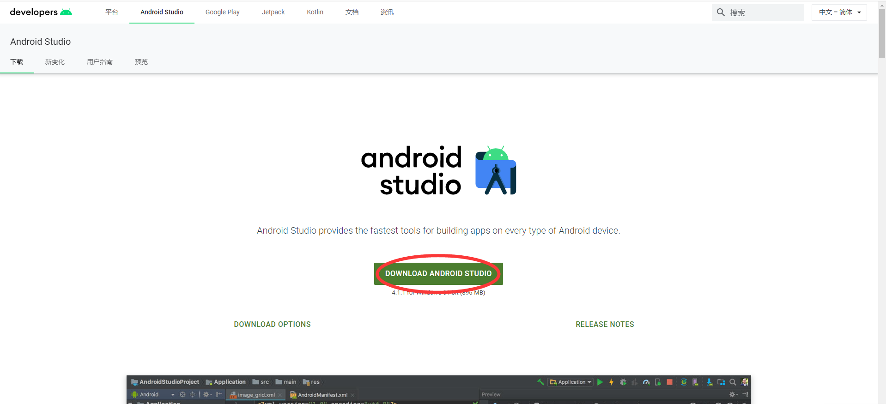
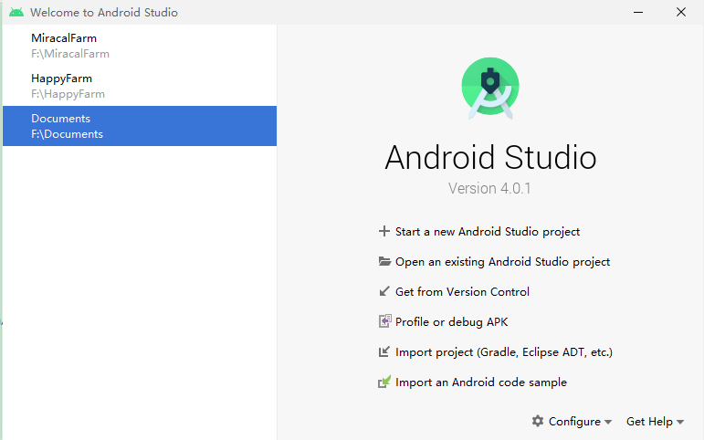
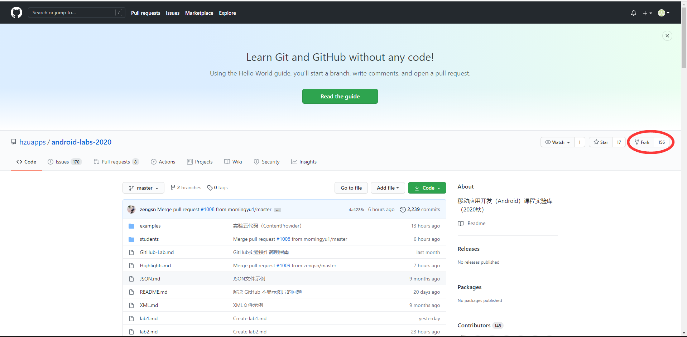
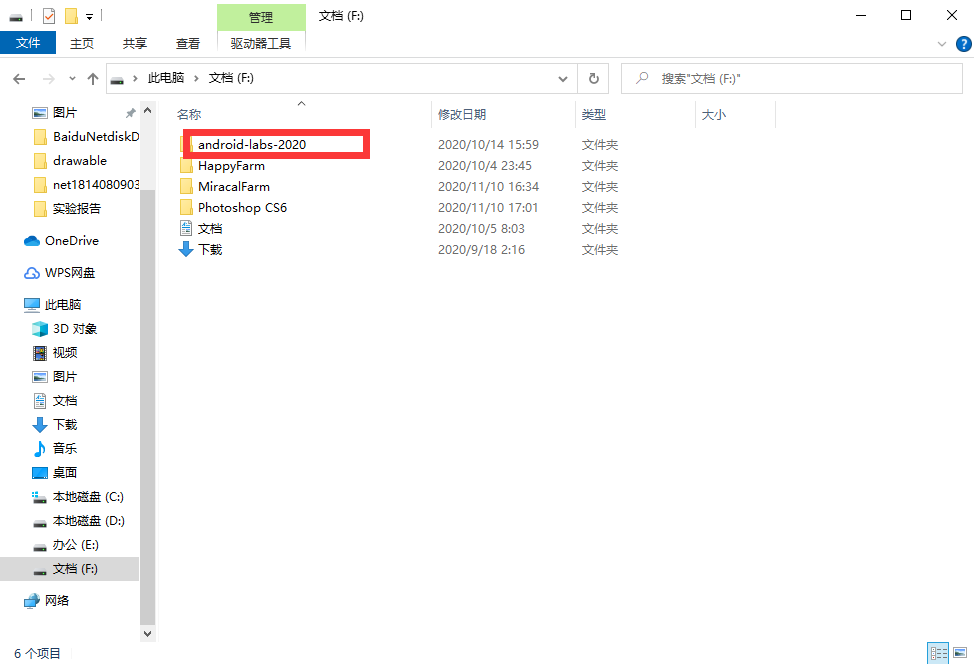
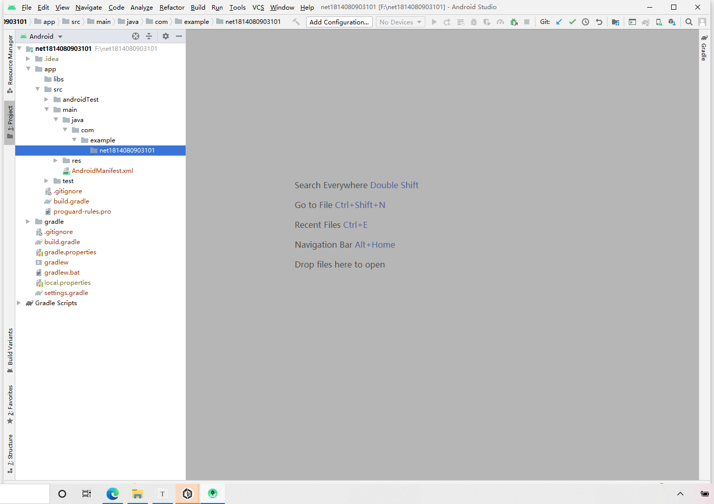

# 实验一 安卓开发环境搭建


## 一、实验目标

​	1.搭建Android(Androidd studio)开发环境；

​	2.熟悉并掌握Git和GitHub.com提交代码的方法。

## 二、实验内容

	1. 搭建Android开发环境；
 	2. 创建项目；
 	3. 创建名为Net1814080903101的Java类；
 	4. 熟练使用Git常用命令。

## 三、实验步骤

​	1.搭建Android开发环境；

​		(1)下载安装



​			(2)打开

​	

​	2.Fork Git项目，并clone到本地目录；

​		(1)加入Git项目



​		(2)克隆项目到本地

```shell
cd F:\
git clone https://github.com/KoKiChiChyan/android-labs-2020/
cd android-labs-2020 
```



​	3.创建Net1814080903101项目；



​	4.创建Net1814080903101.java类；

```java
package edu.hzuapps.androidlabs.net1814080903101;
public class Net1814080903101 {
	public static void main(String args[]){
	}
	}
```

​	5.将该类进行上传提交；

```shell
git add students\net1814080903101\src\main\java\edu\hzuapps\androidlabs\net1814080903101\Net1814080903101.java
git commit -m "#1 #129 第一次实验"
git push
```

## 四、实验结果


## 五、心得体会

​		第一次实验需要熟悉git的使用以及Android Studio开发环境搭建，实验要求中说明的很详细，按照实验要求一步一步做，完成了这一次的实验。

