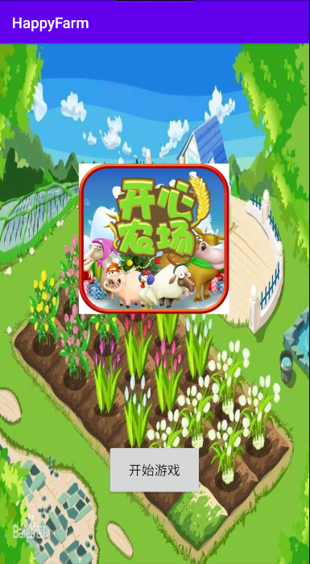

# 实验三 Android资源使用编程


## 一、实验目标

​	1.了解Android应用中各种资源的概念与使用方法；

​	2.掌握Android应用中使用图片等资源的方法。

## 二、实验内容

​	1.在自选题目项目中添加图片；

​	2.在界面上显示至少一张的图片。

## 三、实验步骤

​	activity_net1814080903101.xml代码

```xml
<?xml version="1.0" encoding="utf-8"?>
<androidx.constraintlayout.widget.ConstraintLayout xmlns:android="http://schemas.android.com/apk/res/android"
    xmlns:app="http://schemas.android.com/apk/res-auto"
    xmlns:tools="http://schemas.android.com/tools"
    android:layout_width="match_parent"
    android:layout_height="match_parent"
    android:background="@drawable/test"
    tools:context=".Net1814080903101Activity">

    <Button
        android:id="@+id/button_add"
        android:layout_width="126dp"
        android:layout_height="70dp"
        android:layout_marginBottom="90dp"
        android:text="开始游戏"
        android:textSize="60px"
        app:layout_constraintBottom_toBottomOf="parent"
        app:layout_constraintEnd_toEndOf="parent"
        app:layout_constraintStart_toStartOf="parent" />

    <ImageView
        android:layout_width="200dp"
        android:layout_height="200dp"
        android:layout_marginTop="160dp"
        android:src="@drawable/title"
        app:layout_constraintEnd_toEndOf="parent"
        app:layout_constraintHorizontal_bias="0.497"
        app:layout_constraintStart_toStartOf="parent"
        app:layout_constraintTop_toTopOf="parent" />

</androidx.constraintlayout.widget.ConstraintLayout>
```

​		使用了android:background设置该界面的背景图片，使用了ImageView和android:src在界面中以控件的形式显示图片。

## 四、实验结果



## 五、心得体会

​		这次实验关于安卓项目中资源的使用，重点学习了图片的使用，使用imageview控件以及xml中的src描述可以实现，使界面更加的美观。

