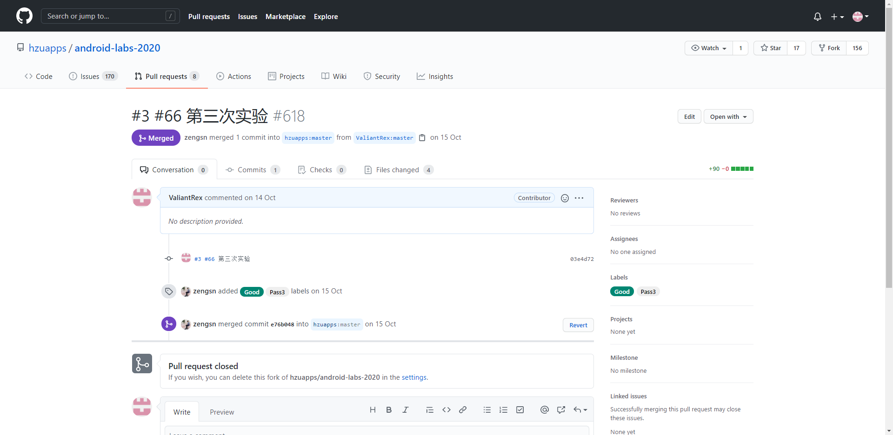

# 实验三 Android资源使用编程


## 一、实验目标


1.了解Android应用中各种资源的概念与使用方法;

2.掌握在Android应用中使用图片等资源的方法.


## 二、实验内容


1.在自选题目项目中添加图片;

2.使用显示.


## 三、实验步骤


1.在drawable中加入图片资源；

2.在ImageView加入图片.

activity_main.xml 

``` xml
<?xml version="1.0" encoding="utf-8"?>
<androidx.constraintlayout.widget.ConstraintLayout xmlns:android="http://schemas.android.com/apk/res/android"
    xmlns:app="http://schemas.android.com/apk/res-auto"
    xmlns:tools="http://schemas.android.com/tools"
    android:layout_width="match_parent"
    android:layout_height="match_parent"
    android:background="#3498db"
    tools:context=".Net1814080903106Activity">

    <Button
        android:id="@+id/toGame"
        android:layout_width="150dp"
        android:layout_height="80dp"
        android:layout_marginBottom="40dp"
        android:text="开始游戏"
        android:textSize="75px"
        app:layout_constraintBottom_toTopOf="@+id/toHistoryScore"
        app:layout_constraintEnd_toEndOf="parent"
        app:layout_constraintStart_toStartOf="parent" />

    <Button
        android:id="@+id/toHistoryScore"
        android:layout_width="150dp"
        android:layout_height="80dp"
        android:layout_marginBottom="84dp"
        android:text="历史分数"
        android:textSize="75px"
        app:layout_constraintBottom_toBottomOf="parent"
        app:layout_constraintEnd_toEndOf="parent"
        app:layout_constraintHorizontal_bias="0.503"
        app:layout_constraintStart_toStartOf="parent" />

    <ImageView
        android:id="@+id/imageView"
        android:layout_width="500dp"
        android:layout_height="200dp"
        android:layout_marginStart="64dp"
        android:layout_marginLeft="64dp"
        app:layout_constraintBottom_toTopOf="@+id/toGame"
        app:layout_constraintStart_toStartOf="parent"
        app:srcCompat="@drawable/transparentwords" />


</androidx.constraintlayout.widget.ConstraintLayout>
```

activity_game.xml

```xml
<?xml version="1.0" encoding="utf-8"?>
<androidx.constraintlayout.widget.ConstraintLayout xmlns:android="http://schemas.android.com/apk/res/android"
    xmlns:app="http://schemas.android.com/apk/res-auto"
    xmlns:tools="http://schemas.android.com/tools"
    android:layout_width="match_parent"
    android:layout_height="match_parent"
    android:background="#3498db"
    tools:context=".GameActivity">

    <TextView
        android:id="@+id/textView"
        android:layout_width="177dp"
        android:layout_height="96dp"
        android:text="游戏界面"
        android:textSize="30dp"
        app:layout_constraintBottom_toBottomOf="parent"
        app:layout_constraintEnd_toEndOf="parent"
        app:layout_constraintHorizontal_bias="0.67"
        app:layout_constraintStart_toStartOf="parent"
        app:layout_constraintTop_toTopOf="parent"
        app:layout_constraintVertical_bias="0.59" />


</androidx.constraintlayout.widget.ConstraintLayout>
```

activity_history_score.xml

```xml
<?xml version="1.0" encoding="utf-8"?>
<androidx.constraintlayout.widget.ConstraintLayout xmlns:android="http://schemas.android.com/apk/res/android"
    xmlns:app="http://schemas.android.com/apk/res-auto"
    xmlns:tools="http://schemas.android.com/tools"
    android:layout_width="match_parent"
    android:layout_height="match_parent"
    android:background="#3498db"
    tools:context=".HistoryScoreActivity">

    <TextView
        android:id="@+id/textView2"
        android:layout_width="328dp"
        android:layout_height="133dp"
        android:layout_marginBottom="144dp"
        android:text="历史分数、历史最高分数查看界面"
        android:textSize="20dp"
        app:layout_constraintBottom_toBottomOf="parent"
        app:layout_constraintEnd_toEndOf="parent"
        app:layout_constraintHorizontal_bias="0.807"
        app:layout_constraintStart_toStartOf="parent" />

</androidx.constraintlayout.widget.ConstraintLayout>
```


## 四、实验结果





## 五、实验心得

​		

​		这次的实验是通过ImageView来添加图片实现在布局内使用图片资源，初次尝试只在主界面内添加了图片，后续也会继续将自己的项目的各个界面美化。