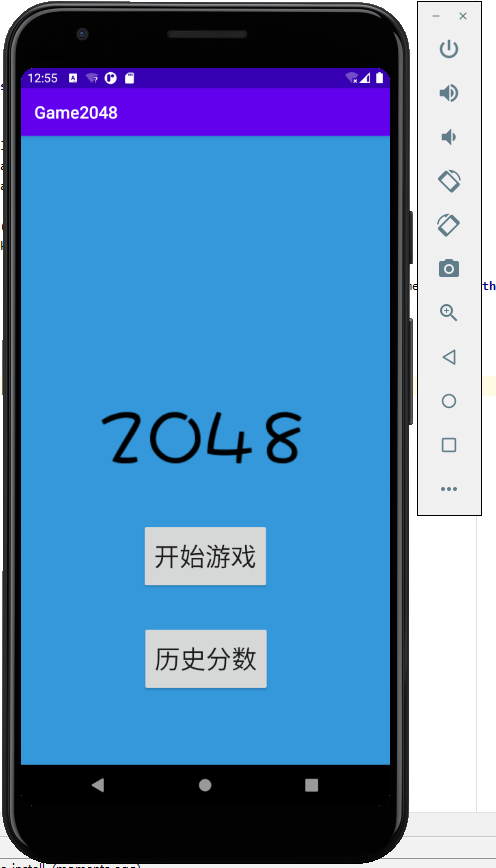
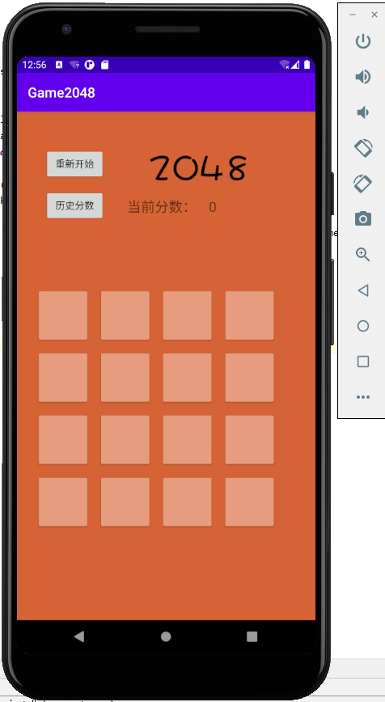
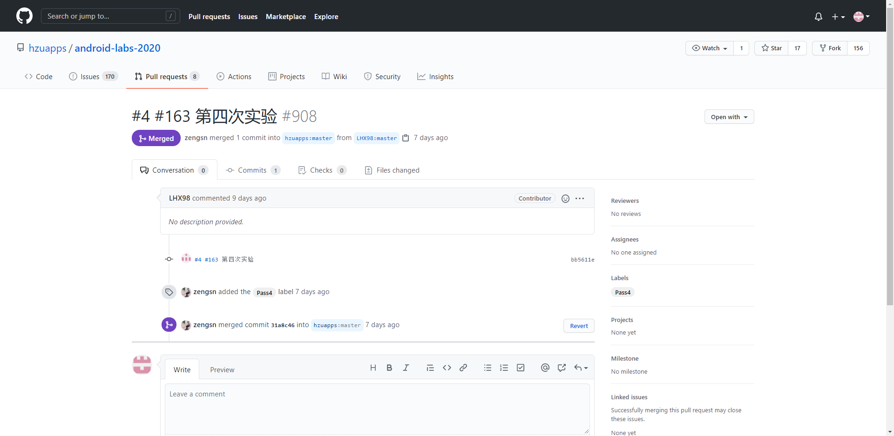

# 实验四 Android界面设计编程


## 一、实验目标


1.根据选题要求设计界面布局及控件使用;

2.布局xml及界面控制操作代码并提交截图;

3.将应用运行结果截图.


## 二、实验内容


1.在所学的几种布局方式中自行选择设计界面;

2.通过findViewByID获取界面对象，执行相关操作;

3.实现界面控件的事件处理.


## 三、实验步骤


1.对各个界面布局进行设计;

2.完善各个布局的控件.

Net1814080903106.java

```java
package edu.hzuapp.androidlabs;
import androidx.appcompat.app.AppCompatActivity;
import android.content.Intent;
import android.os.Bundle;
import android.view.View;
import android.widget.Button;
public class Net1814080903106Activity extends AppCompatActivity {
    @Override
    protected void onCreate(Bundle savedInstanceState) {
        super.onCreate(savedInstanceState);
        setContentView(R.layout.activity_main);
        Button buttonToGame = (Button)findViewById(R.id.toGame);
        buttonToGame.setOnClickListener(new View.OnClickListener() {
                                            @Override
                                            public void onClick(View v) {
                                                Intent intent = new Intent();
                                                intent.setClass(Net1814080903106Activity.this, GameActivity.class);
                                                startActivity(intent);
                                            }
                                        }
        );
        Button buttonToHistoryScore = (Button)findViewById(R.id.toHistoryScore);
        buttonToHistoryScore.setOnClickListener(new View.OnClickListener() {
                                                    @Override
                                                    public void onClick(View v) {
                                                        Intent intent = new Intent();
                                                        intent.setClass(Net1814080903106Activity.this, HistoryScoreActivity.class);
                                                        startActivity(intent);
                                                    }
                                                }
        );

    }
}
```


GameActivity.java

```java
package edu.hzuapp.androidlabs;

import androidx.appcompat.app.AppCompatActivity;

import android.content.Intent;
import android.os.Bundle;
import android.view.View;
import android.widget.Button;

public class GameActivity extends AppCompatActivity {

    @Override
    protected void onCreate(Bundle savedInstanceState) {
        super.onCreate(savedInstanceState);
        setContentView(R.layout.activity_game);

        Button toHistoryScore = (Button)findViewById(R.id.toHistoryScore);
        toHistoryScore.setOnClickListener(new View.OnClickListener() {
                                                    @Override
                                                    public void onClick(View v) {
                                                        Intent intent = new Intent();
                                                        intent.setClass(GameActivity.this, HistoryScoreActivity.class);
                                                        startActivity(intent);
                                                    }
                                                }
        );


    }
} 
```

HistoryScoreActivity.java

```java
package edu.hzuapp.androidlabs;

import androidx.appcompat.app.AppCompatActivity;

import android.content.Intent;
import android.os.Bundle;
import android.view.View;
import android.widget.Button;

public class HistoryScoreActivity extends AppCompatActivity {

    @Override
    protected void onCreate(Bundle savedInstanceState) {
        super.onCreate(savedInstanceState);
        setContentView(R.layout.activity_history_score);

        Button returnToGame = (Button)findViewById(R.id.returnToGame);
        returnToGame.setOnClickListener(new View.OnClickListener() {
                                            @Override
                                            public void onClick(View v) {
                                                Intent intent = new Intent();
                                                intent.setClass(HistoryScoreActivity.this, GameActivity.class);
                                                startActivity(intent);
                                            }
                                        }
        );

        Button returnToMain = (Button)findViewById(R.id.returnToMain);
        returnToMain.setOnClickListener(new View.OnClickListener() {
                                            @Override
                                            public void onClick(View v) {
                                                Intent intent = new Intent();
                                                intent.setClass(HistoryScoreActivity.this, Net1814080903106Activity.class);
                                                startActivity(intent);
                                            }
                                        }
        );

    }

} 
```

activity_game.xml

```xml
<?xml version="1.0" encoding="utf-8"?>
<androidx.constraintlayout.widget.ConstraintLayout xmlns:android="http://schemas.android.com/apk/res/android"
    xmlns:app="http://schemas.android.com/apk/res-auto"
    xmlns:tools="http://schemas.android.com/tools"
    android:layout_width="match_parent"
    android:layout_height="match_parent"
    android:background="#3498db"
    android:background="#d56336"
    tools:context=".GameActivity">


    //显示出分数数值


    <Button
        android:id="@+id/restart"
        android:layout_width="wrap_content"
        android:layout_height="wrap_content"
        android:layout_marginStart="40dp"
        android:layout_marginLeft="40dp"
        android:layout_marginTop="52dp"
        android:text="重新开始"
        app:layout_constraintStart_toStartOf="parent"
        app:layout_constraintTop_toTopOf="parent" />

    <Button
        android:id="@+id/toHistoryScore"
        android:layout_width="wrap_content"
        android:layout_height="wrap_content"
        android:layout_marginStart="40dp"
        android:layout_marginLeft="40dp"
        android:layout_marginTop="12dp"
        android:text="历史分数"
        app:layout_constraintStart_toStartOf="parent"
        app:layout_constraintTop_toBottomOf="@+id/restart" />

    <ImageView
        android:id="@+id/imageView"
        android:layout_width="303dp"
        android:layout_height="58dp"
        android:layout_marginStart="44dp"
        android:layout_marginLeft="44dp"
        android:layout_marginTop="52dp"
        app:layout_constraintStart_toEndOf="@+id/restart"
        app:layout_constraintTop_toTopOf="parent"
        app:srcCompat="@drawable/transparentwords" />

    <TextView
        android:id="@+id/textView"
        android:layout_width="177dp"
        android:layout_height="96dp"
        android:text="游戏界面"
        android:textSize="30dp"
        app:layout_constraintBottom_toBottomOf="parent"
        android:id="@+id/currentScoreTextView"
        android:layout_width="114dp"
        android:layout_height="27dp"
        android:layout_marginTop="124dp"
        android:layout_marginEnd="4dp"
        android:layout_marginRight="4dp"
        android:text="当前分数："
        android:textSize="20dp"
        app:layout_constraintEnd_toStartOf="@+id/currentScore"
        app:layout_constraintTop_toTopOf="parent" />

    <TextView
        android:id="@+id/currentScore"
        android:layout_width="138dp"
        android:layout_height="43dp"
        android:layout_marginTop="124dp"
        android:layout_marginEnd="16dp"
        android:layout_marginRight="16dp"
        android:text="0"
        android:textSize="20dp"
        app:layout_constraintEnd_toEndOf="parent"
        app:layout_constraintHorizontal_bias="0.67"
        app:layout_constraintTop_toTopOf="parent" />

    <androidx.cardview.widget.CardView
        android:id="@+id/grid00"
        android:layout_width="70dp"
        android:layout_height="70dp"
        android:layout_marginStart="32dp"
        android:layout_marginLeft="32dp"
        android:layout_marginTop="100dp"
        app:cardBackgroundColor="#e59c7f"
        app:layout_constraintStart_toStartOf="parent"
        app:layout_constraintTop_toTopOf="parent"
        app:layout_constraintVertical_bias="0.59" />
        app:layout_constraintTop_toBottomOf="@+id/toHistoryScore">

    </androidx.cardview.widget.CardView>

    <androidx.cardview.widget.CardView
        android:id="@+id/grid01"
        android:layout_width="70dp"
        android:layout_height="70dp"
        android:layout_marginStart="20dp"
        android:layout_marginLeft="8dp"
        android:layout_marginTop="100dp"
        app:cardBackgroundColor="#e59c7f"
        app:layout_constraintStart_toEndOf="@+id/grid00"
        app:layout_constraintTop_toBottomOf="@+id/toHistoryScore">

    </androidx.cardview.widget.CardView>

    <androidx.cardview.widget.CardView
        android:id="@+id/grid02"
        android:layout_width="70dp"
        android:layout_height="70dp"
        android:layout_marginStart="20dp"
        android:layout_marginLeft="20dp"
        android:layout_marginTop="100dp"
        app:cardBackgroundColor="#e59c7f"
        app:layout_constraintStart_toEndOf="@+id/grid01"
        app:layout_constraintTop_toBottomOf="@+id/toHistoryScore">

    </androidx.cardview.widget.CardView>

    <androidx.cardview.widget.CardView
        android:id="@+id/grid03"
        android:layout_width="70dp"
        android:layout_height="70dp"
        android:layout_marginStart="20dp"
        android:layout_marginLeft="20dp"
        android:layout_marginTop="100dp"
        app:layout_constraintEnd_toEndOf="parent"
        app:layout_constraintHorizontal_bias="0.0"
        app:cardBackgroundColor="#e59c7f"
        app:layout_constraintStart_toEndOf="@+id/grid02"
        app:layout_constraintTop_toBottomOf="@+id/toHistoryScore">

    </androidx.cardview.widget.CardView>

    <androidx.cardview.widget.CardView
        android:id="@+id/grid10"
        android:layout_width="70dp"
        android:layout_height="70dp"
        android:layout_marginStart="32dp"
        android:layout_marginLeft="32dp"
        android:layout_marginTop="20dp"
        app:cardBackgroundColor="#e59c7f"
        app:layout_constraintStart_toStartOf="parent"
        app:layout_constraintTop_toBottomOf="@+id/grid00">

    </androidx.cardview.widget.CardView>

    <androidx.cardview.widget.CardView
        android:id="@+id/grid11"
        android:layout_width="70dp"
        android:layout_height="70dp"
        android:layout_marginStart="20dp"
        android:layout_marginLeft="20dp"
        android:layout_marginTop="20dp"
        app:cardBackgroundColor="#e59c7f"
        app:layout_constraintStart_toEndOf="@+id/grid10"
        app:layout_constraintTop_toBottomOf="@+id/grid01" >

    </androidx.cardview.widget.CardView>

    <androidx.cardview.widget.CardView
        android:id="@+id/grid12"
        android:layout_width="70dp"
        android:layout_height="70dp"
        android:layout_marginStart="20dp"
        android:layout_marginLeft="20dp"
        android:layout_marginTop="20dp"
        app:cardBackgroundColor="#e59c7f"
        app:layout_constraintStart_toEndOf="@+id/grid11"
        app:layout_constraintTop_toBottomOf="@+id/grid02" />

    <androidx.cardview.widget.CardView
        android:id="@+id/grid13"
        android:layout_width="70dp"
        android:layout_height="70dp"
        android:layout_marginStart="20dp"
        android:layout_marginLeft="20dp"
        android:layout_marginTop="20dp"
        app:layout_constraintEnd_toEndOf="parent"
        app:layout_constraintHorizontal_bias="0.0"
        app:cardBackgroundColor="#e59c7f"
        app:layout_constraintStart_toEndOf="@+id/grid12"
        app:layout_constraintTop_toBottomOf="@+id/grid03">

    </androidx.cardview.widget.CardView>

    <androidx.cardview.widget.CardView
        android:id="@+id/grid20"
        android:layout_width="70dp"
        android:layout_height="70dp"
        android:layout_marginStart="32dp"
        android:layout_marginLeft="32dp"
        android:layout_marginTop="20dp"
        app:cardBackgroundColor="#e59c7f"
        app:layout_constraintStart_toStartOf="parent"
        app:layout_constraintTop_toBottomOf="@+id/grid10">

    </androidx.cardview.widget.CardView>

    <androidx.cardview.widget.CardView
        android:id="@+id/grid21"
        android:layout_width="70dp"
        android:layout_height="70dp"
        android:layout_marginStart="20dp"
        android:layout_marginLeft="20dp"
        android:layout_marginTop="20dp"
        app:cardBackgroundColor="#e59c7f"
        app:layout_constraintStart_toEndOf="@+id/grid20"
        app:layout_constraintTop_toBottomOf="@+id/grid11" />

    <androidx.cardview.widget.CardView
        android:id="@+id/grid22"
        android:layout_width="70dp"
        android:layout_height="70dp"
        android:layout_marginStart="20dp"
        android:layout_marginLeft="20dp"
        android:layout_marginTop="20dp"
        app:cardBackgroundColor="#e59c7f"
        app:layout_constraintStart_toEndOf="@+id/grid21"
        app:layout_constraintTop_toBottomOf="@+id/grid12" >

    </androidx.cardview.widget.CardView>

    <androidx.cardview.widget.CardView
        android:id="@+id/grid23"
        android:layout_width="70dp"
        android:layout_height="70dp"
        android:layout_marginStart="20dp"
        android:layout_marginLeft="20dp"
        android:layout_marginTop="20dp"
        app:layout_constraintEnd_toEndOf="parent"
        app:layout_constraintHorizontal_bias="0.0"
        app:cardBackgroundColor="#e59c7f"
        app:layout_constraintStart_toEndOf="@+id/grid22"
        app:layout_constraintTop_toBottomOf="@+id/grid13">

    </androidx.cardview.widget.CardView>

    <androidx.cardview.widget.CardView
        android:id="@+id/grid30"
        android:layout_width="70dp"
        android:layout_height="70dp"
        android:layout_marginStart="32dp"
        android:layout_marginLeft="32dp"
        android:layout_marginTop="20dp"
        app:cardBackgroundColor="#e59c7f"
        app:layout_constraintBottom_toBottomOf="parent"
        app:layout_constraintStart_toStartOf="parent"
        app:layout_constraintTop_toBottomOf="@+id/grid20"
        app:layout_constraintVertical_bias="0.0">

    </androidx.cardview.widget.CardView>

    <androidx.cardview.widget.CardView
        android:id="@+id/grid31"
        android:layout_width="70dp"
        android:layout_height="70dp"
        android:layout_marginStart="20dp"
        android:layout_marginLeft="20dp"
        android:layout_marginTop="20dp"
        app:cardBackgroundColor="#e59c7f"
        app:layout_constraintBottom_toBottomOf="parent"
        app:layout_constraintStart_toEndOf="@+id/grid30"
        app:layout_constraintTop_toBottomOf="@+id/grid21"
        app:layout_constraintVertical_bias="0.0">

    </androidx.cardview.widget.CardView>

    <androidx.cardview.widget.CardView
        android:id="@+id/grid32"
        android:layout_width="70dp"
        android:layout_height="70dp"
        android:layout_marginStart="20dp"
        android:layout_marginLeft="20dp"
        android:layout_marginTop="20dp"
        app:cardBackgroundColor="#e59c7f"
        app:layout_constraintBottom_toBottomOf="parent"
        app:layout_constraintStart_toEndOf="@+id/grid31"
        app:layout_constraintTop_toBottomOf="@+id/grid22"
        app:layout_constraintVertical_bias="0.0">

    </androidx.cardview.widget.CardView>

    <androidx.cardview.widget.CardView
        android:id="@+id/grid33"
        android:layout_width="70dp"
        android:layout_height="70dp"
        android:layout_marginStart="20dp"
        android:layout_marginLeft="20dp"
        android:layout_marginTop="20dp"
        app:cardBackgroundColor="#e59c7f"
        app:layout_constraintBottom_toBottomOf="parent"
        app:layout_constraintEnd_toEndOf="parent"
        app:layout_constraintHorizontal_bias="0.0"
        app:layout_constraintStart_toEndOf="@+id/grid32"
        app:layout_constraintTop_toBottomOf="@+id/grid23"
        app:layout_constraintVertical_bias="0.0">

    </androidx.cardview.widget.CardView>


</androidx.constraintlayout.widget.ConstraintLayout>
```

activity_history_score.xml

```xml
<?xml version="1.0" encoding="utf-8"?>
<androidx.constraintlayout.widget.ConstraintLayout xmlns:android="http://schemas.android.com/apk/res/android"
    xmlns:app="http://schemas.android.com/apk/res-auto"
    xmlns:tools="http://schemas.android.com/tools"
    android:layout_width="match_parent"
    android:layout_height="match_parent"
    android:background="#3498db"
    tools:context=".HistoryScoreActivity">

    <TextView
        android:id="@+id/textView"
        android:layout_width="185dp"
        android:layout_height="80dp"
        android:layout_marginStart="56dp"
        android:layout_marginLeft="56dp"
        android:layout_marginTop="156dp"
        android:text="历史最高分："
        android:textSize="30dp"
        app:layout_constraintStart_toStartOf="parent"
        app:layout_constraintTop_toBottomOf="@+id/returnToGame" />

    <TextView
        android:id="@+id/textView2"
        android:layout_width="328dp"
        android:layout_height="133dp"
        android:layout_marginBottom="144dp"
        android:text="历史分数、历史最高分数查看界面"
        android:textSize="20dp"
        app:layout_constraintBottom_toBottomOf="parent"
        android:layout_width="121dp"
        android:layout_height="39dp"
        android:layout_marginTop="156dp"
        android:text="2048"
        android:textSize="30dp"
        app:layout_constraintEnd_toEndOf="parent"
        app:layout_constraintHorizontal_bias="0.183"
        app:layout_constraintStart_toEndOf="@+id/textView"
        app:layout_constraintTop_toBottomOf="@+id/returnToMain" />

    <Button
        android:id="@+id/returnToGame"
        android:layout_width="wrap_content"
        android:layout_height="wrap_content"
        android:layout_marginTop="56dp"
        android:text="返回游戏"
        app:layout_constraintEnd_toStartOf="@+id/returnToMain"
        app:layout_constraintHorizontal_bias="0.266"
        app:layout_constraintStart_toStartOf="parent"
        app:layout_constraintTop_toTopOf="parent" />

    <Button
        android:id="@+id/returnToMain"
        android:layout_width="wrap_content"
        android:layout_height="wrap_content"
        android:layout_marginTop="56dp"
        android:layout_marginEnd="40dp"
        android:layout_marginRight="40dp"
        android:text="返回主界面"
        app:layout_constraintEnd_toEndOf="parent"
        app:layout_constraintHorizontal_bias="0.807"
        app:layout_constraintStart_toStartOf="parent" />
        app:layout_constraintTop_toTopOf="parent" />

</androidx.constraintlayout.widget.ConstraintLayout>
```


## 四、实验结果


​	主界面



---

游戏界面



---

历史分数界面


---





## 五、实验心得

​	

​		本次实验基本上完成了对整个app的框架的设计与调整，在对前几次的实验以及本次实验进行完善和修饰后此时基本上app的雏形已经建立，在之后的实验里会继续为该app添加功能进行完善。

