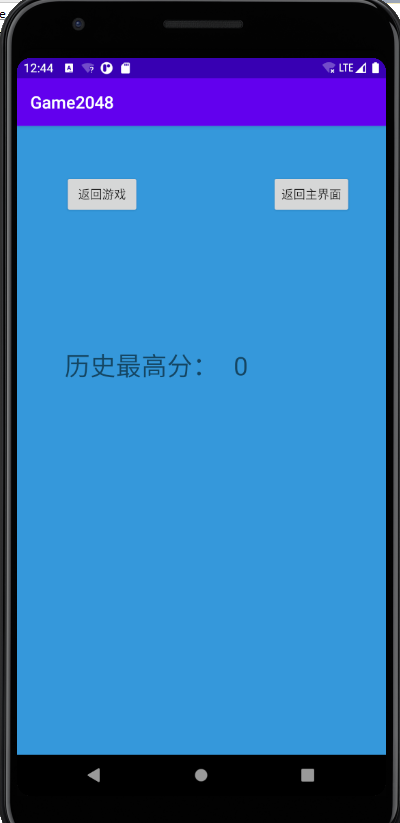
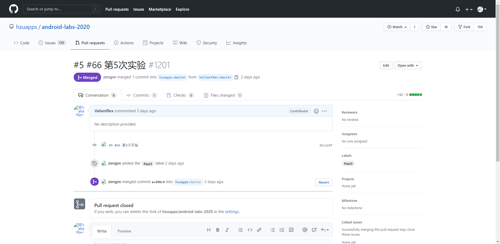

# 实验五 Android存储编程

## 一、实验目标


1.了解Android的存储手段；

2.掌握Android的文件存储;

3.掌握Android的数据库存储.


## 二、实验内容


1.将应用产生的数据保存到文件存储中;

2.使用内部存储将产生的数据保存到文件存储中;

3.将结果截图.


## 三、实验步骤

1.新建一个名为ScoreSave的java类用于编写内部存储;

2.编写内部存储代码;

```java
package edu.hzuapp.androidlabs;

import android.app.Application;
import android.content.SharedPreferences;
import android.util.Log;

import java.lang.reflect.Method;

public class ScoreSave {
    public static void save(Integer nowScore){
        SharedPreferences scoresSave = ApplicationGetter.getCurApplication().getSharedPreferences("scoresSave", 0);
        SharedPreferences.Editor edit = scoresSave.edit();
        Integer preScore = Integer.valueOf(scoresSave.getString("MaxScore","0"));
        nowScore = preScore>nowScore?preScore:nowScore;
        edit.putString("MaxScore",String.valueOf(nowScore));
        edit.commit();
    }

    public static String load(){
        SharedPreferences scoresSave = ApplicationGetter.getCurApplication().getSharedPreferences("scoresSave", 0);
        SharedPreferences.Editor edit = scoresSave.edit();
        return scoresSave.getString("MaxScore","0");
    }

    private static class ApplicationGetter{
        public static Application getCurApplication(){
            Application application = null;
            try{
                Class atClass = Class.forName("android.app.ActivityThread");
                Method currentApplicationMethod = atClass.getDeclaredMethod("currentApplication");
                currentApplicationMethod.setAccessible(true);
                application = (Application) currentApplicationMethod.invoke(null);
                Log.d("fw_create","curApp class1:"+application);
            }catch (Exception e){
                Log.d("fw_create","e:"+e.toString());
            }

            if(application != null)
                return application;
            try{
                Class atClass = Class.forName("android.app.AppGlobals");
                Method currentApplicationMethod = atClass.getDeclaredMethod("getInitialApplication");
                currentApplicationMethod.setAccessible(true);
                application = (Application) currentApplicationMethod.invoke(null);
                Log.d("fw_create","curApp class2:"+application);
            }catch (Exception e){
                Log.d("fw_create","e:"+e.toString());
            }
            return application;
        }
    }
}

```

3.在HistoryScoreActivity.java和GameActivity.java中调用函数.


## 四、运行结果及截图


历史分数界面






## 五、实验心得

​		本次实验的难度较大，在本次实验中为自己的项目编写了内部存储的方法，且当未开始游戏时，自动赋予默认值为0，此后每一次游戏后得到的分数与存储中的分数作比较，大则替换，成为新的最高分。


