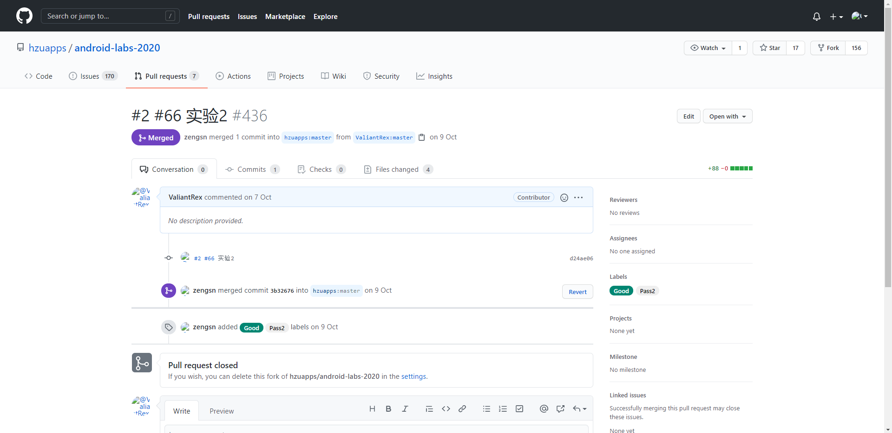

# 实验二 Android组件编程


## 一、实验目标


1.在Issues中创建自己的选题:http://github.com/hzuapps/android-labs-2020/issues;

2.根据自选题目，编写一个或多个Activity(主窗口类带上学号前缀，放到自己的Java包下);

3.将标题设置为自己的学号+对应的功能或题目;

4.根据自己选择的题目实现Activity中导航、调用等功能(选做).


## 二、实验内容


1.创建自己的安卓项目选题;

2.根据自选题在Android Studio中创建一个或多个Activity;

3.实现一个Activity与另一个Activity之间的跳转(显式或隐式).


## 三、实验步骤


1.创建3个Activity； <br>主界面Activity:Net1814080903106Activity.java<br>游戏界面Activity:GameActivity.java<br>历史分数界面Activity:HistoryScoreActivity<br>

2.在Activity上添加按钮、链接或导航栏，实现各个Activity的跳转.

主界面Net1814080903106Activity.java

```java
package edu.hzuapp.androidlabs;

import androidx.appcompat.app.AppCompatActivity;

import android.content.Intent;
import android.os.Bundle;
import android.view.View;
import android.widget.Button;

public class Net1814080903106Activity extends AppCompatActivity {

    @Override
    protected void onCreate(Bundle savedInstanceState) {
        super.onCreate(savedInstanceState);
        setContentView(R.layout.activity_main);

        Button buttonToGame = (Button)findViewById(R.id.toGame);
        buttonToGame.setOnClickListener(new View.OnClickListener() {
                                            @Override
                                            public void onClick(View v) {
                                                Intent intent = new Intent();
                                                intent.setClass(Net1814080903106Activity.this, GameActivity.class);
                                                startActivity(intent);
                                            }
                                        }
        );


        Button buttonToHistoryScore = (Button)findViewById(R.id.toHistoryScore);
        buttonToHistoryScore.setOnClickListener(new View.OnClickListener() {
                                                    @Override
                                                    public void onClick(View v) {
                                                        Intent intent = new Intent();
                                                        intent.setClass(Net1814080903106Activity.this, HistoryScoreActivity.class);
                                                        startActivity(intent);
                                                    }
                                                }
        );
    }
} 
```

游戏界面GameActivity.java

``` java
package edu.hzuapp.androidlabs;

import androidx.appcompat.app.AppCompatActivity;

import android.os.Bundle;

public class GameActivity extends AppCompatActivity {

    @Override
    protected void onCreate(Bundle savedInstanceState) {
        super.onCreate(savedInstanceState);
        setContentView(R.layout.activity_game);
    }
} 
```

历史分数界面HistoryScoreActivity.java

``` java
package edu.hzuapp.androidlabs;

import androidx.appcompat.app.AppCompatActivity;

import android.os.Bundle;

public class GameActivity extends AppCompatActivity {

    @Override
    protected void onCreate(Bundle savedInstanceState) {
        super.onCreate(savedInstanceState);
        setContentView(R.layout.activity_game);
    }
} 
```


## 四、实验结果





## 五、实验心得

​		

​		本次实验在实验课上做了两个按钮分别是从主界面跳转到游戏界面以及从主界面跳转到历史分数查看界面，在跟着老师的步骤进行实验能够自己开始设想自己的各个界面并开始逐渐接触和上手。

