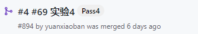

# 一、实验目标

1. 根据选题要求设计界面布局及控件使用；
2. 布局xml及界面控制操作代码提交并截图；
3. 将应用运行结果截图。

# 二、实验内容

1. 使用一种布局方式设计界面；
2. 通过控件ID获取界面对象，执行相关操作：

```
// XML
android:id="@+id/my_button"
// Java
findViewById(R.id.my_button);
```

1. 实现界面控件的事件处理;
2. 操作之后，切换到第二个界面。

# 三、实验步骤

1. 根据自己项目设置了constraintlayout。

2. 在constraintlayout中使用ListView

   ```xml
   <FrameLayout xmlns:android="http://schemas.android.com/apk/res/android"
       android:layout_width="match_parent"
       android:layout_height="wrap_content"
       xmlns:app="http://schemas.android.com/apk/res-auto">
   
       <ListView
           android:id="@+id/homeList"
           android:layout_width="match_parent"
           android:layout_height="match_parent" />
   </FrameLayout>
   ```

   

3. 创建ListView中显示的组件（xml文件）

   ```xml
   <androidx.constraintlayout.widget.ConstraintLayout
       xmlns:android="http://schemas.android.com/apk/res/android"
       xmlns:app="http://schemas.android.com/apk/res-auto"
       xmlns:tools="http://schemas.android.com/tools"
       android:layout_width="match_parent"
       android:layout_height="match_parent">
       <androidx.cardview.widget.CardView
       android:id="@+id/HomeCard"
       android:layout_width="match_parent"
       android:layout_height="wrap_content"
       android:layout_margin="12dp"
       app:cardCornerRadius="10dp"
       app:cardElevation="4dp"
       app:cardPreventCornerOverlap="false"
       app:layout_constraintBottom_toBottomOf="parent"
       app:layout_constraintEnd_toEndOf="parent"
       app:layout_constraintStart_toStartOf="parent"
       app:layout_constraintTop_toTopOf="parent">
   
       <LinearLayout
           android:layout_width="match_parent"
           android:layout_height="wrap_content"
           android:orientation="vertical">
   
           <ImageView
               android:id="@+id/homeCardImageView"
               android:layout_width="match_parent"
               android:layout_height="150dp"
               android:scaleType="centerCrop"
               android:src="@drawable/title" />
   
           <TextView
               android:id="@+id/homeCardTitle"
               android:layout_width="match_parent"
               android:layout_height="wrap_content"
               android:layout_margin="8dp"
               android:text="这是标题"
               android:textColor="#000000"
               android:textSize="20sp"
               android:textStyle="bold" />
       </LinearLayout>
   
   </androidx.cardview.widget.CardView>
   </androidx.constraintlayout.widget.ConstraintLayout>
   ```

4. 代码实现listview填充

   ```java
   public class HomePresenter extends BaseAdapter {
       private ScenesModel scenesModel = null;
       private HomeFragment fragment = null;
       String[] scenes = new String[0];
   
   
       public HomePresenter(HomeFragment homeFragment){
           fragment = homeFragment;
           scenesModel = ScenesModel.getInstance();
           scenes = scenesModel.getSceneNameArray();
       };
   
       @Override
       public int getCount() {
           return scenesModel.getCount();
       }
   
       @Override
       public Object getItem(int position) {
           return scenesModel;
       }
   
       @Override
       public long getItemId(int position) {
           return position;
       }
   
       @Override
       public View getView(int position, View convertView, ViewGroup parent) {
           LayoutInflater layoutInflater = (LayoutInflater) LayoutInflater.from(fragment.getActivity());
           convertView = layoutInflater.inflate(R.layout.item_scene, null,true);
           ImageView imageView = convertView.findViewById(R.id.homeCardImageView);
           TextView textView = convertView.findViewById(R.id.homeCardTitle);
           imageView.setImageBitmap(scenesModel.getImage(scenes[position]));
           textView.setText(scenes[position]);
           return convertView;
       }
   }
   ```

# 四、实验结果



# 五、实验心得

认识了各个布局的界面，根据自己项目的需要选择了constraintlayout，同时组件选用了较为美观的cardview，内部是需要显示的数据，还学会了BaseAdapter的使用方法，能够实现自动的listview填充。