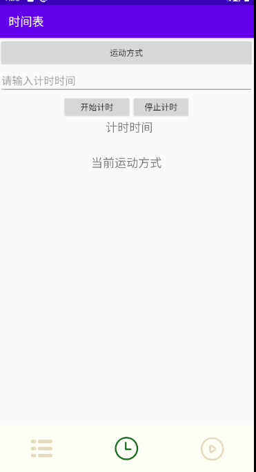

# 一、实验目标

1. 根据选题要求设计界面布局及控件使用；
2. 布局xml及界面控制操作代码提交并截图；
3. 将应用运行结果截图。

# 二、实验内容

1. 使用一种布局方式设计界面；
2. 通过控件ID获取界面对象，执行相关操作：

```
// XML
android:id="@+id/my_button"
// Java
findViewById(R.id.my_button);
```

1. 实现界面控件的事件处理;
2. 操作之后，切换到第二个界面。

# 三、实验步骤

1. 根据自己项目设置了Linearlayout。

2. 创建ListView中显示的组件

   ```倒计时模块各部件的填充
   <?xml version="1.0" encoding="utf-8"?>
   <androidx.constraintlayout.widget.ConstraintLayout xmlns:android="http://schemas.android.com/apk/res/android"
       xmlns:app="http://schemas.android.com/apk/res-auto"
       xmlns:tools="http://schemas.android.com/tools"
       android:layout_width="match_parent"
       android:layout_height="match_parent"
       android:visibility="visible">
   
       <Button
           android:id="@+id/selectButton"
           android:layout_width="fill_parent"
           android:layout_height="50dp"
           android:layout_marginTop="4dp"
           android:layout_weight="1"
           android:text="运动方式"
           android:visibility="visible"
           app:layout_constraintEnd_toEndOf="parent"
           app:layout_constraintHorizontal_bias="1.0"
           app:layout_constraintStart_toStartOf="parent"
           app:layout_constraintTop_toTopOf="parent" />
   
       <EditText
           android:id="@+id/et_timer"
           android:layout_width="match_parent"
           android:layout_height="wrap_content"
           android:hint="请输入计时时间"
           app:layout_constraintEnd_toEndOf="parent"
           app:layout_constraintStart_toStartOf="parent"
           app:layout_constraintTop_toBottomOf="@+id/selectButton" />
   
       <LinearLayout
           android:id="@+id/linearLayout2"
           android:layout_width="402dp"
           android:layout_height="60dp"
           android:layout_marginTop="76dp"
           android:orientation="horizontal"
           app:layout_constraintEnd_toEndOf="parent"
           app:layout_constraintHorizontal_bias="0.082"
           app:layout_constraintStart_toStartOf="parent"
           app:layout_constraintTop_toBottomOf="@+id/et_timer">
   
           <Button
               android:id="@+id/stopButton"
               android:layout_width="203dp"
               android:layout_height="match_parent"
               android:layout_weight="1"
               android:text="停止计时" />
   
           <Button
               android:id="@+id/startButton"
               android:layout_width="189dp"
               android:layout_height="60dp"
               android:layout_marginBottom="464dp"
               android:layout_weight="1"
               android:text="开始计时" />
       </LinearLayout>
   
       <TextView
           android:id="@+id/text_time"
           android:layout_width="fill_parent"
           android:layout_height="60dp"
           android:layout_marginTop="20dp"
           android:gravity="center_horizontal"
           android:text="  计时时间"
           android:textAlignment="center"
           android:textSize="20dp"
           app:layout_constraintEnd_toEndOf="parent"
           app:layout_constraintHorizontal_bias="1.0"
           app:layout_constraintStart_toStartOf="parent"
           app:layout_constraintTop_toBottomOf="@+id/linearLayout2" />
   
       <TextView
           android:id="@+id/text_sport"
           android:layout_width="fill_parent"
           android:layout_height="60dp"
           android:layout_marginTop="12dp"
           android:gravity="center_horizontal"
           android:text="当前运动方式"
           android:textAlignment="center"
           android:textSize="20dp"
           app:layout_constraintEnd_toEndOf="parent"
           app:layout_constraintHorizontal_bias="1.0"
           app:layout_constraintStart_toStartOf="parent"
           app:layout_constraintTop_toBottomOf="@+id/text_time" />
   
       <Button
           android:id="@+id/gettimeButton"
           android:layout_width="fill_parent"
           android:layout_height="62dp"
           android:layout_marginTop="44dp"
           android:text="获取计时"
           app:layout_constraintEnd_toEndOf="parent"
           app:layout_constraintHorizontal_bias="0.0"
           app:layout_constraintStart_toStartOf="parent"
           app:layout_constraintTop_toTopOf="@+id/et_timer" />
   
   </androidx.constraintlayout.widget.ConstraintLayout>
   
   ```
   
3. 倒计时模块各部件的填充

   ```
    private void countDown(){
           Button starbutton = (Button)view.findViewById(R.id.startButton);
           Button stopbutton = (Button)view.findViewById(R.id.stopButton);
           Button gettimebutton = (Button)view.findViewById(R.id.gettimeButton);
           EditText et_time = (EditText)view.findViewById(R.id.et_timer);
           text_time = (TextView)view.findViewById(R.id.text_time);
           TextView text_sport = (TextView)view.findViewById(R.id.text_sport);
   
           starbutton.setOnClickListener(new View.OnClickListener() {
               @Override
               public void onClick(View v) {
   
               }
           });
   
           stopbutton.setOnClickListener(new View.OnClickListener() {
               @Override
               public void onClick(View v) {
   
               }
           });
   
           gettimebutton.setOnClickListener(new View.OnClickListener() {
               @Override
               public void onClick(View v) {
   
               }
           });
       }
   ```
3. 可选择运动方式的单选框
```
     public void SelectButton(){
            AlertDialog.Builder builder = new AlertDialog.Builder(fragment.getContext());
               builder.setTitle("请选择运动方式");
               final String items[] = {"跑步","打球","游泳","登山"};
               builder.setSingleChoiceItems(items, -1, new DialogInterface.OnClickListener() {
                   @Override
                   public void onClick(DialogInterface dialog, int which) {
                       String item = items[which];
                       Toast.makeText(fragment.getActivity(),item.toString(),Toast.LENGTH_LONG).show();
   
                       dialog.dismiss();
                   }
               });
               builder.show();
   
           }
```
# 四、实验结果



# 五、实验心得

在布局方面根据自身的需要设计选择了Linearlayout布局，同时根据布局需要创建了较多的组件。
