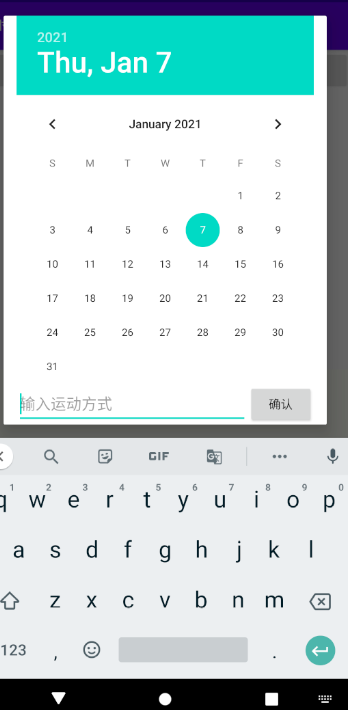

# 实验五

## 一、实验目标

1.了解Andoid的存储手段;
2.掌握Android的文件存储;
3.掌握Android的数据库存储.

## 二、实验内容

1. 将应用产生的数据存储到数据库
2. 使用数据库存储

## 三、实验步骤

代码如下：

```
package edu.hzuapps.androidlabs.model;

import android.app.Application;
import android.database.Cursor;
import android.database.sqlite.SQLiteDatabase;
import android.util.Log;

import java.lang.reflect.Method;
import java.util.ArrayList;

import edu.hzuapps.androidlabs.bean.ScheduleItem;

public class SchedulesModel {
    private static ArrayList<ScheduleItem> itemArrayList = new ArrayList<>();
    private static int count = 0;
    private static SQLiteDatabase db = null;
    private static SchedulesModel schedulesModel = new SchedulesModel();
    private SchedulesModel(){
        String dbPath = ApplicationGetter.getCurApplication().getFilesDir().getAbsolutePath() + "schedule.db";
        db = SQLiteDatabase.openOrCreateDatabase(dbPath,null);
        seekorCreateTable();
    }

    private void seekorCreateTable(){
        StringBuilder sql = new StringBuilder("create table if not exists schedule(");
        sql.append("_id integer primary key autoincrement,");
        sql.append("date text NOT NULL,");
        sql.append("message text NOT NULL)");
        db.execSQL(sql.toString());
        count = count();
        initItemArray();
    }

    public static SchedulesModel getInstance(){
       return schedulesModel;
    };
    public int getCount() { return count; }

    private int count() {
        Cursor cursor = db.query("schedule", null, null, null, null, null, null);
        int count = cursor.getCount();
        cursor.close();
        return count;
    }


    public static Object getItem(int position) {
        return itemArrayList.get(position);
    }


    private void initItemArray(){
        Cursor cursor = db.query("schedule", null, null, null, null, null, null);
        if (cursor.moveToFirst()) {
            int i = 0;
            ScheduleItem item;
            do {
                item = new ScheduleItem(cursor.getInt(0),cursor.getString(1),cursor.getString(2));
                itemArrayList.add(item);
            }while(cursor.moveToNext());
        }
    }

    private static class ApplicationGetter{
        public static Application getCurApplication(){
            Application application = null;
            try{
                Class atClass = Class.forName("android.app.ActivityThread");
                Method currentApplicationMethod = atClass.getDeclaredMethod("currentApplication");
                currentApplicationMethod.setAccessible(true);
                application = (Application) currentApplicationMethod.invoke(null);
                Log.d("fw_create","curApp class1:"+application);
            }catch (Exception e){
                Log.d("fw_create","e:"+e.toString());
            }

            if(application != null)
                return application;
            try{
                Class atClass = Class.forName("android.app.AppGlobals");
                Method currentApplicationMethod = atClass.getDeclaredMethod("getInitialApplication");
                currentApplicationMethod.setAccessible(true);
                application = (Application) currentApplicationMethod.invoke(null);
                Log.d("fw_create","curApp class2:"+application);
            }catch (Exception e){
                Log.d("fw_create","e:"+e.toString());
            }
            return application;
        }
    }
}

```

## 四、实验结果截图

可以新增运动计划



## 五、实验心得

通过这次实验学会了Andorid中的存储手段，这次使用了数据库存储，并掌握数据库存储。