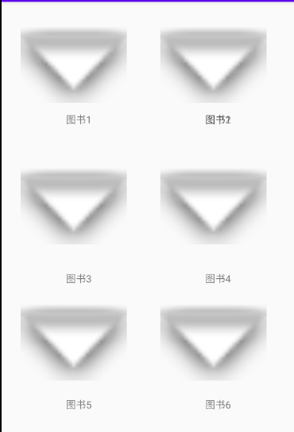

# 实验四

## 一、实验目标

1. 根据选题要求设计界面布局及控件使用；
2. 布局xml及界面控制操作代码提交并截图；
3. 将应用运行结果截图。

## 二、实验内容

1. 使用一种布局方式设计界面；
2. 通过控件ID获取界面对象，执行相关操作：
3. 实现界面控件的事件处理;
4. 操作之后，切换到第二个界面。

## 三、实验步骤

1.novel_search.xml采用线性布局，设置搜索功能；

```xml
<LinearLayout
    android:layout_width="match_parent"
    android:layout_height="match_parent"
    android:orientation="horizontal"
    app:layout_constraintBottom_toBottomOf="parent"
    app:layout_constraintEnd_toEndOf="parent"
    app:layout_constraintStart_toStartOf="parent"
    app:layout_constraintTop_toTopOf="parent">

    <LinearLayout
        android:layout_width="match_parent"
        android:layout_height="match_parent"
        android:orientation="horizontal">

        <TextView
            android:id="@+id/textView"
            android:layout_width="350dp"
            android:layout_height="31dp"
            android:text="请输入搜索内容" />

        <Button
            android:id="@+id/button2"
            android:layout_width="wrap_content"
            android:layout_height="wrap_content"
            android:text="搜索" />
    </LinearLayout>

</LinearLayout>
```

2.my_bookshelf.xml自适应布局，显示已经购买的图书； 

```xml
<androidx.constraintlayout.widget.ConstraintLayout xmlns:android="http://schemas.android.com/apk/res/android"
    xmlns:app="http://schemas.android.com/apk/res-auto"
    xmlns:tools="http://schemas.android.com/tools"
    android:layout_width="match_parent"
    android:layout_height="match_parent"
    tools:context=".MyBookshelf">

    <TextView
        android:id="@+id/textView8"
        android:layout_width="wrap_content"
        android:layout_height="wrap_content"
        android:text="图书6"
        app:layout_constraintBottom_toBottomOf="parent"
        app:layout_constraintEnd_toEndOf="parent"
        app:layout_constraintHorizontal_bias="0.762"
        app:layout_constraintStart_toStartOf="parent"
        app:layout_constraintTop_toTopOf="parent"
        app:layout_constraintVertical_bias="0.948" />

    <TextView
        android:id="@+id/textView7"
        android:layout_width="wrap_content"
        android:layout_height="wrap_content"
        android:text="图书4"
        app:layout_constraintBottom_toBottomOf="parent"
        app:layout_constraintEnd_toEndOf="parent"
        app:layout_constraintHorizontal_bias="0.762"
        app:layout_constraintStart_toStartOf="parent"
        app:layout_constraintTop_toTopOf="parent"
        app:layout_constraintVertical_bias="0.646" />

    <TextView
        android:id="@+id/textView6"
        android:layout_width="wrap_content"
        android:layout_height="wrap_content"
        android:text="图书5"
        app:layout_constraintBottom_toBottomOf="parent"
        app:layout_constraintEnd_toEndOf="parent"
        app:layout_constraintHorizontal_bias="0.242"
        app:layout_constraintStart_toStartOf="parent"
        app:layout_constraintTop_toTopOf="parent"
        app:layout_constraintVertical_bias="0.948" />

    <TextView
        android:id="@+id/textView5"
        android:layout_width="wrap_content"
        android:layout_height="wrap_content"
        android:text="图书3"
        app:layout_constraintBottom_toBottomOf="parent"
        app:layout_constraintEnd_toEndOf="parent"
        app:layout_constraintHorizontal_bias="0.242"
        app:layout_constraintStart_toStartOf="parent"
        app:layout_constraintTop_toTopOf="parent"
        app:layout_constraintVertical_bias="0.646" />

    <TextView
        android:id="@+id/textView3"
        android:layout_width="wrap_content"
        android:layout_height="wrap_content"
        android:text="图书2"
        app:layout_constraintBottom_toBottomOf="parent"
        app:layout_constraintEnd_toEndOf="parent"
        app:layout_constraintHorizontal_bias="0.762"
        app:layout_constraintStart_toStartOf="parent"
        app:layout_constraintTop_toTopOf="parent"
        app:layout_constraintVertical_bias="0.265" />

    <TextView
        android:id="@+id/textView2"
        android:layout_width="wrap_content"
        android:layout_height="wrap_content"
        android:text="图书1"
        app:layout_constraintBottom_toBottomOf="parent"
        app:layout_constraintEnd_toEndOf="parent"
        app:layout_constraintHorizontal_bias="0.242"
        app:layout_constraintStart_toStartOf="parent"
        app:layout_constraintTop_toTopOf="parent"
        app:layout_constraintVertical_bias="0.265" />

    <ImageView
        android:id="@+id/imageView6"
        android:layout_width="149dp"
        android:layout_height="110dp"
        app:layout_constraintBottom_toBottomOf="parent"
        app:layout_constraintEnd_toEndOf="parent"
        app:layout_constraintHorizontal_bias="0.103"
        app:layout_constraintStart_toStartOf="parent"
        app:layout_constraintTop_toTopOf="parent"
        app:layout_constraintVertical_bias="0.851"
        app:srcCompat="@android:drawable/arrow_down_float" />

    <ImageView
        android:id="@+id/imageView7"
        android:layout_width="149dp"
        android:layout_height="110dp"
        app:layout_constraintBottom_toBottomOf="parent"
        app:layout_constraintEnd_toEndOf="parent"
        app:layout_constraintHorizontal_bias="0.851"
        app:layout_constraintStart_toStartOf="parent"
        app:layout_constraintTop_toTopOf="parent"
        app:layout_constraintVertical_bias="0.851"
        app:srcCompat="@android:drawable/arrow_down_float" />

    <ImageView
        android:id="@+id/imageView5"
        android:layout_width="149dp"
        android:layout_height="110dp"
        app:layout_constraintBottom_toBottomOf="parent"
        app:layout_constraintEnd_toEndOf="parent"
        app:layout_constraintHorizontal_bias="0.851"
        app:layout_constraintStart_toStartOf="parent"
        app:layout_constraintTop_toTopOf="parent"
        app:layout_constraintVertical_bias="0.465"
        app:srcCompat="@android:drawable/arrow_down_float" />

    <ImageView
        android:id="@+id/imageView2"
        android:layout_width="149dp"
        android:layout_height="110dp"
        app:layout_constraintBottom_toBottomOf="parent"
        app:layout_constraintEnd_toEndOf="parent"
        app:layout_constraintHorizontal_bias="0.103"
        app:layout_constraintStart_toStartOf="parent"
        app:layout_constraintTop_toTopOf="parent"
        app:layout_constraintVertical_bias="0.064"
        app:srcCompat="@android:drawable/arrow_down_float" />

    <ImageView
        android:id="@+id/imageView4"
        android:layout_width="149dp"
        android:layout_height="110dp"
        app:layout_constraintBottom_toBottomOf="parent"
        app:layout_constraintEnd_toEndOf="parent"
        app:layout_constraintHorizontal_bias="0.851"
        app:layout_constraintStart_toStartOf="parent"
        app:layout_constraintTop_toTopOf="parent"
        app:layout_constraintVertical_bias="0.064"
        app:srcCompat="@android:drawable/arrow_down_float" />

    <ImageView
        android:id="@+id/imageView3"
        android:layout_width="149dp"
        android:layout_height="110dp"
        app:layout_constraintBottom_toBottomOf="parent"
        app:layout_constraintEnd_toEndOf="parent"
        app:layout_constraintHorizontal_bias="0.103"
        app:layout_constraintStart_toStartOf="parent"
        app:layout_constraintTop_toTopOf="parent"
        app:layout_constraintVertical_bias="0.465"
        app:srcCompat="@android:drawable/arrow_down_float" />

</androidx.constraintlayout.widget.ConstraintLayout>
```

## 四、实验结果




## 五、实验心得

本次实验是根据自己的项目进一步完善界面设计，后续需要进行数据库的连接才能进一步完成界面设定的效果显示。