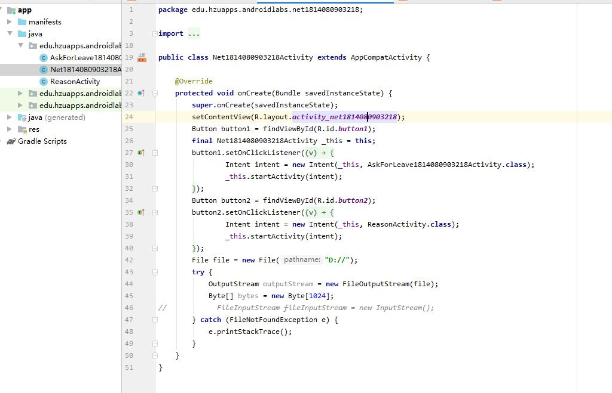

# 一、实验目标

1. 构建安卓开发环境

2. 熟悉git的操作与使用方法

# 二、实验内容

1. 搭建android开发环境
2. 创建运行测试java类
3. 使用git同步文件到github
# 三、实验步骤

1. 下载androidSDK

2. 官网下载androidStdio,并且同时在androidstdio中下载androiAVD模拟器

3. 运行测试Net1812070504101MainActivity的java类

4. 显示hello world!

5. 将项目克隆到本地

  ```
  $ cd D:\  
  $ git clone https://github.com/Wumuu/android-labs-2020/    
  $ cd android-labs-202
  ```
6. 在android Stdio中编写Net1814080903218MainActivity的java类
7. 提交代码并请求合并
```
$ git add D:\android-labs-2020\students\net1814080903113/Net1812070504101MainActivity.java
$ git commit -m "第1次实验"
$ git push
```
# 四、实验结果

 

# 五、实验心得

熟悉了Android Studio 的使用方法，以及如何通过Git远程上传代码到Github。