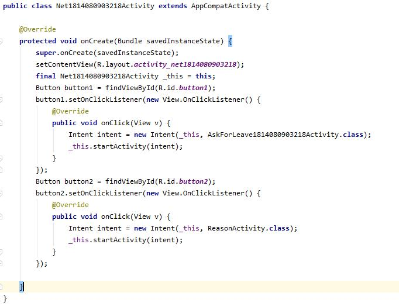

## 一、实验目标

1. 创建2-3个与自己选题有关的Activity

2. 利用Intent实现Activity间的跳转

## 二、实验内容

1. 根据功能创建相应的Activity

2. 编写Activity对应的布局文件

3. 实现各个Activity之间的跳转

4. 上交实验相关文件

## 三、实验步骤

1. 将创建的Activity注册到AndroidManifest.xml

2. 在MainActivity的layout视图中添加Button按钮用于跳转页面

3. 为Button按扭添加Click点击事件实现跳转

    ```java
Button button1 = findViewById(R.id.***\**button1\**\***);
button1.setOnClickListener(***\*new\**** View.OnClickListener() {
    @Override
    ***\*public void\**** onClick(View v) {
    Intent intent = ***\*new\**** Intent(_this, AskForLeave1814080903218Activity.***\*class\****);
    _this.startActivity(intent);
    }
});
Button button2 = findViewById(R.id.***\**button2\**\***);
button2.setOnClickListener(***\*new\**** View.OnClickListener() {
    @Override
    ***\*public void\**** onClick(View v) {
    Intent intent = ***\*new\**** Intent(_this, ReasonActivity.***\*class\****);
    _this.startActivity(intent);
    }
});
    ```
4. 上交实验相关文件

## 四、实验结果

 

## 五、实验心得

学会了如何添加Activity页面，还有添加按钮以及在按钮添加点击事件从而实现页面跳转。