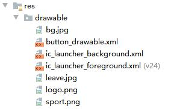

# 一、实验目标

1. 根据选题要求设计界面布局及控件使用；
2. 布局xml及界面控制操作代码提交并截图；
3. 将应用运行结果截图。（不要做登陆注册！）

# 二、实验内容

1. 使用一种布局方式设计界面；
2. 通过控件ID获取界面对象，执行相关操作：
3. 实现界面控件的事件处理;
4. 操作之后，切换到第二个界面。

# 三、实验步骤

1. 将图片资源（如logo.png）放在res/drawable文件夹下。
 

   

2. 在<LinearLayout>添加<ImageView>和<Button>

```
<ImageView
        android:id="@+id/image"
        android:layout_width="wrap_content"
        android:layout_height="wrap_content"
        android:src="@drawable/logo"
        android:maxHeight="1000dp"
        android:maxWidth="1000dp"
        android:adjustViewBounds="true"
        />
    <Button
        android:id="@+id/buttona1"
        android:layout_width="wrap_content"
        android:layout_height="wrap_content"
        android:layout_gravity="center_horizontal"
        android:background="@drawable/button_drawable"
        android:textColor="#ffffff"
        android:textSize="16dp"
        android:gravity="center_horizontal"

        android:text="查看信息"
        />

    <Button
        android:id="@+id/buttona2"
        android:layout_width="wrap_content"
        android:layout_height="wrap_content"
        android:layout_gravity="center_horizontal"
        android:background="@drawable/button_drawable"
        android:gravity="center_horizontal"
        android:text="申请请假"
        android:textColor="#ffffff"
        android:layout_marginTop="10dp"
        android:textSize="16dp" />

    <Button
        android:id="@+id/buttona3"
        android:layout_width="wrap_content"
        android:layout_height="wrap_content"
        android:layout_gravity="center_horizontal"
        android:background="@drawable/button_drawable"
        android:gravity="center_horizontal"
        android:text="运动记录"
        android:textColor="#ffffff"
        android:layout_marginTop="10dp"
        android:textSize="16dp" />
```


3. 在Net1814080903218Activity类中添加按钮点击事件实现跳转
```
final Net1814080903218Activity _this = this;
        Button button1 = findViewById(R.id.buttona1);
        button1.setOnClickListener(new View.OnClickListener() {
            @Override
            public void onClick(View v) {
                Intent intent = new Intent(_this, InfoActivity.class);
                _this.startActivity(intent);
            }
        });
        Button button2 = findViewById(R.id.buttona2);
        button2.setOnClickListener(new View.OnClickListener() {
            @Override
            public void onClick(View v) {
                Intent intent = new Intent(_this, ReasonActivity.class);
                _this.startActivity(intent);
            }
        });
        Button button3 = findViewById(R.id.buttona3);
        button3.setOnClickListener(new View.OnClickListener() {
            @Override
            public void onClick(View v) {
                Intent intent = new Intent(_this, SportActivity.class);
                _this.startActivity(intent);
            }
        });
```


# 四、实验结果


# 五、实验心得

这次实验了解了如何在Android应用中添加图片资源，放在res文件夹下的drawable中，再通过地址进行引用。