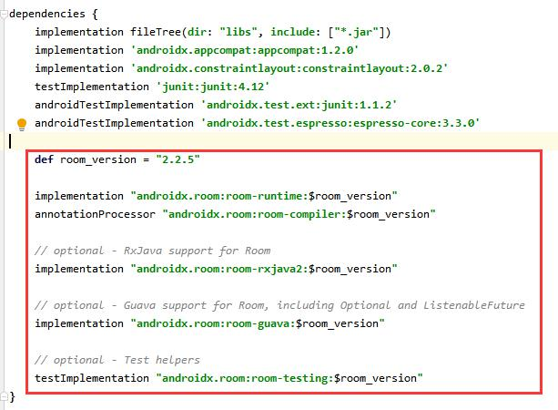
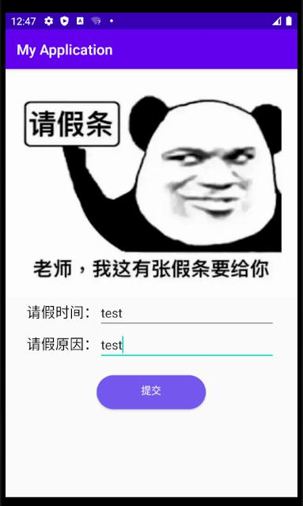
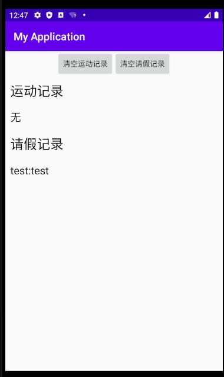

# 一、实验目标

1. 1.了解Andoid的存储手段
2. 掌握Android的文件存储
3. 掌握Android的数据库存储

# 二、实验内容

1. 将应用产生的数据保存到文件存储中；
2. 使用内部存储将产生的数据保存到文件存储中；
3. 将运行结果截图

# 三、实验步骤

1. 在build.gradle中引入数据库依赖。
  
2. 创建AppDatabase类。

```
@Database(entities = {Reason.class, Sport.class}, version = 1)
public abstract class AppDatabase extends RoomDatabase {
    public abstract ReasonDao getReasonDao();
    public abstract SportDao getSportDao();
}
```


3. 创建与数据库表对应的实体类（以reason为例）
```
@Database(entities = {Reason.class, Sport.class}, version = 1)
public abstract class AppDatabase extends RoomDatabase {
    public abstract ReasonDao getReasonDao();
    public abstract SportDao getSportDao();
}
```
4. 创建操作实体类的Dao接口（以ReasonDao为例）。
```
@Dao
public interface ReasonDao {
    @Query("SELECT * FROM reason")
    List<Reason> getAll();

    @Insert
    void insert(Reason reason);

    @Query("delete from reason")
    void deleteAll();
}
```


5. 在java中编写代码实现业务（以ReasonActivity为例）。
```
public class ReasonActivity extends AppCompatActivity {
    private AppDatabase db;
    private ReasonDao reasonDao;

    @Override
    protected void onCreate(Bundle savedInstanceState) {
        super.onCreate(savedInstanceState);
        setContentView(R.layout.activity_reason);
        final ReasonActivity _this = this;
        db = Room.databaseBuilder(getApplicationContext(),
                AppDatabase.class, "app").allowMainThreadQueries().build();
        reasonDao = db.getReasonDao();
        final EditText timeText = (EditText)findViewById(R.id.time);
        final EditText reasonText = (EditText)findViewById(R.id.reason);
        Button sub = findViewById(R.id.sub);
        sub.setOnClickListener(new View.OnClickListener() {
            @Override
            public void onClick(View v) {
                String time = timeText.getText().toString();
                String reason = reasonText.getText().toString();
                Reason reasonData = new Reason(time,reason);
                reasonDao.insert(reasonData);
                Intent intent=new Intent(_this,Net1814080903218Activity.class);
                startActivity(intent);
            }
        });
    }
}
```


# 四、实验结果




# 五、实验心得

学会了使用Room操作数据库，了解了保存数据的方法和获取数据显示到界面的流程。