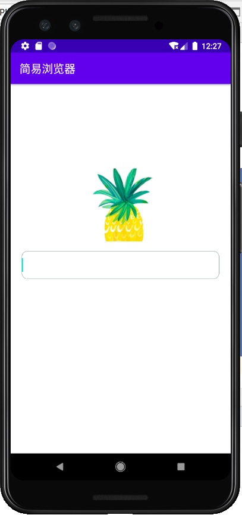

# 	一、实验目标

1. 了解Android应用中各种资源的概念与使用方法；
2. 掌握在Android应用中使用图片等资源的方法。

# 二、实验内容

1. 在界面上显示至少一张图片（按照自己的题目添加）；
2. 提交res/drawable及图片使用的代码；
3. 提交res/values, res/layout等其他代码；
4. 将应用运行结果截图，放到实验报告中；

# 三、实验步骤

1. 将需要导入的图片保存到res/drawable路径中；
2. 在layout的xml文件中用ImagView导入图片作为背景：

```xml
<RelativeLayout
    android:layout_width="match_parent"
    android:layout_height="400dp"
    android:orientation="vertical">
    <!--   logo     -->
    <ImageView
        android:id="@+id/logo"
        android:layout_width="200dp"
        android:layout_height="130dp"
        android:layout_marginStart="100dp"
        android:layout_marginTop="150dp"
        android:background="#111111"
        android:scaleType="centerCrop"
        android:src="@drawable/logo" />
    <!--   浏览窗口     -->
    <EditText
        android:id="@+id/address"
        android:layout_width="match_parent"
        android:layout_height="50dp"
        android:layout_alignBottom="@id/logo"
        android:layout_marginLeft="20dp"
        android:layout_marginRight="20dp"
        android:layout_marginBottom="-67dp"
        android:background="@drawable/edit_text"
        android:inputType="text"
        android:maxLines="1" />
</RelativeLayout>
```


# 四、实验结果



# 五、实验心得

导入图片时可能会遇到选择的图片的背景不合适等问题，这个时候也要有一点图片编辑的能力。通过ImageView控件可以添加图片，实现在布局中调用图片资源，达到美化界面或展示图片的功能。