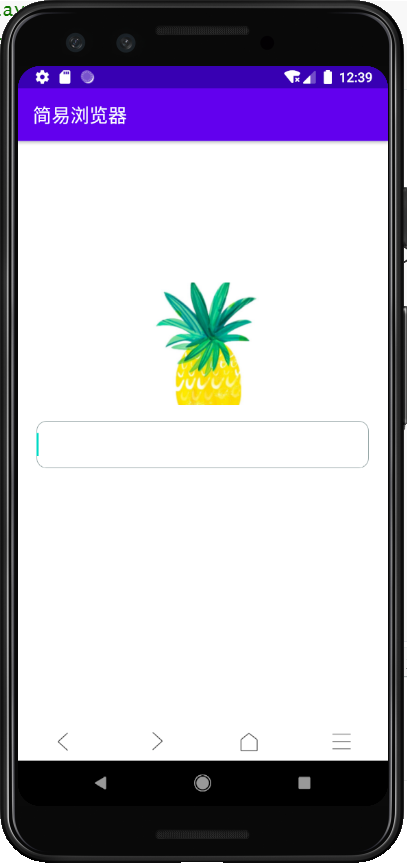
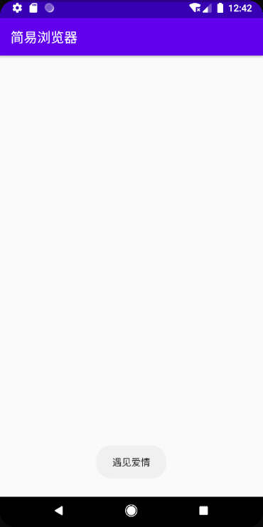

# 一、实验目标

1. 根据选题要求设计界面布局及控件使用；
2. 布局xml及界面控制操作代码提交并截图；
3. 将应用运行结果截图。

# 二、实验内容

1. 使用一种布局方式设计界面；
2. 通过控件ID获取界面对象，执行相关操作：

3. 实现界面控件的事件处理;

# 三、实验步骤

1. 从阿里图标库中下载图标，导入到项目中

2. 使用相对布局在界面中显示图标

   ```xml
   <LinearLayout
       android:layout_width="match_parent"
       android:layout_height="40dp"
       android:baselineAligned="false"
       android:layout_alignParentBottom="true"
   
       android:layout_marginTop="740dp">
       <RelativeLayout style="@style/NavItem">
   
           <ImageView
               android:id="@+id/nav_left"
               style="@style/NavIcon"
               android:layout_width="wrap_content"
               android:src="@drawable/nav_left" />
       </RelativeLayout>
   
       <RelativeLayout style="@style/NavItem">
   
           <ImageView
               android:id="@+id/nav_right"
               style="@style/NavIcon"
               android:layout_width="wrap_content"
               android:src="@drawable/nav_right" />
       </RelativeLayout>
   
   
   
       <RelativeLayout style="@style/NavItem">
   
           <ImageView
               android:id="@+id/nav_home"
               style="@style/NavIcon"
               android:layout_width="wrap_content"
               android:src="@drawable/nav_home" />
       </RelativeLayout>
   
       <RelativeLayout style="@style/NavItem">
   
           <ImageView
               android:id="@+id/bookmarks"
               style="@style/NavIcon"
               android:layout_width="wrap_content"
               android:src="@drawable/nav_menu" />
       </RelativeLayout>
   </LinearLayout>
   ```

3. 使用相对布局和线性布局设计界面

   ```xml
   <?xml version="1.0" encoding="utf-8"?>
   <RelativeLayout xmlns:android="http://schemas.android.com/apk/res/android"
       xmlns:app="http://schemas.android.com/apk/res-auto"
       xmlns:tools="http://schemas.android.com/tools"
       android:layout_width="match_parent"
       android:layout_height="match_parent"
       tools:context=".Sec1814080911108Activity"
       android:orientation="vertical"
       android:background="#ffffff">
   
       <RelativeLayout
           android:layout_width="match_parent"
           android:layout_height="400dp"
           android:orientation="vertical">
   
           <!--   logo     -->
           <ImageView
               android:id="@+id/logo"
               android:layout_width="200dp"
               android:layout_height="130dp"
               android:layout_marginStart="100dp"
               android:layout_marginTop="150dp"
               android:background="#111111"
               android:scaleType="centerCrop"
               android:src="@drawable/logo" />
           <!--   浏览窗口     -->
           <EditText
               android:id="@+id/address"
               android:layout_width="match_parent"
               android:layout_height="50dp"
               android:layout_alignBottom="@id/logo"
               android:layout_marginLeft="20dp"
               android:layout_marginRight="20dp"
               android:layout_marginBottom="-67dp"
               android:background="@drawable/edit_text"
               android:inputType="text"
               android:maxLines="1" />
       </RelativeLayout>
       <LinearLayout
           android:layout_width="match_parent"
           android:layout_height="40dp"
           android:baselineAligned="false"
           android:layout_alignParentBottom="true"
   
           android:layout_marginTop="740dp">
           <RelativeLayout style="@style/NavItem">
   
               <ImageView
                   android:id="@+id/nav_left"
                   style="@style/NavIcon"
                   android:layout_width="wrap_content"
                   android:src="@drawable/nav_left" />
           </RelativeLayout>
   
           <RelativeLayout style="@style/NavItem">
   
               <ImageView
                   android:id="@+id/nav_right"
                   style="@style/NavIcon"
                   android:layout_width="wrap_content"
                   android:src="@drawable/nav_right" />
           </RelativeLayout>
   
   
   
           <RelativeLayout style="@style/NavItem">
   
               <ImageView
                   android:id="@+id/nav_home"
                   style="@style/NavIcon"
                   android:layout_width="wrap_content"
                   android:src="@drawable/nav_home" />
           </RelativeLayout>
   
           <RelativeLayout style="@style/NavItem">
   
               <ImageView
                   android:id="@+id/bookmarks"
                   style="@style/NavIcon"
                   android:layout_width="wrap_content"
                   android:src="@drawable/nav_menu" />
           </RelativeLayout>
       </LinearLayout>
   </RelativeLayout>
   ```

   

4. 为图标添加点击事件，为之后的功能设计打下基础

```java
// 按钮添加点击事件
ImageView btnBookmarks = (ImageView)findViewById(R.id.bookmarks);
//btnBookmarks.setColorFilter(Color.parseColor("#ffffff"));
btnBookmarks.setOnClickListener(new View.OnClickListener() {
    @Override
    public void onClick(View view) {
        // 发出Toast
        Toast.makeText(Sec1814080911108Activity.this, "遇见爱情", Toast.LENGTH_SHORT).show();
        // 显式Intent
        Intent intent = new Intent(Sec1814080911108Activity.this,LoveListActivity.class);
        startActivity(intent);
    }
});
```


# 四、实验结果



点击书签按钮后发生跳转：




# 五、实验心得

在添加图标之后在design界面中可以完整显示，但实际在虚拟机运行时书签按钮会变成白色。这个问题困扰了我比较久的时间，之后判断运行时出现问题就应该是Java代码中的异常，后来排除出来是在点击事件中改变了ImageView的颜色。