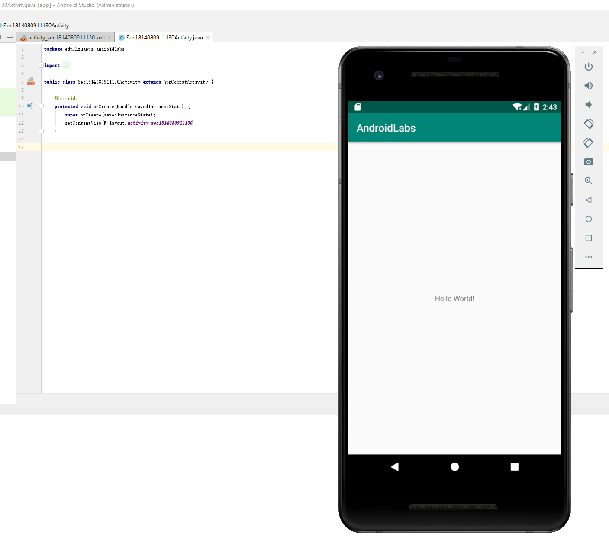

# 一、实验目标  

1. 搭建 Android（Android Studio）开发环境
2. 熟悉并掌握Git与GitHub.com提交实验代码的方法

# 二、实验内容

1. 搭建Android开发环境
2. 创建项目
3. 创建名为Sec1814080911130Activity的java类
4. 运行显示HelloWorld
5. 熟练Git常用命令

# 三、实验步骤

1. 搭建Android开发环境
2. 将项目Fork到自己的仓库
3. 将项目克隆到本地  
4. 创建学号文件夹sec1814080903210
5. 创建名为Sec1814080911130Activity的java类
6. 提交代码并请求合并

# 四、实验结果

.png)

# 五、实验心得

&#160; &#160; &#160; &#160;本次实验学习了如何在github上提交作业和打开Android Studio，由于第一次用很多东西不懂，在同学的指引下用了GitHub Desktop来提交作业，方便快捷。