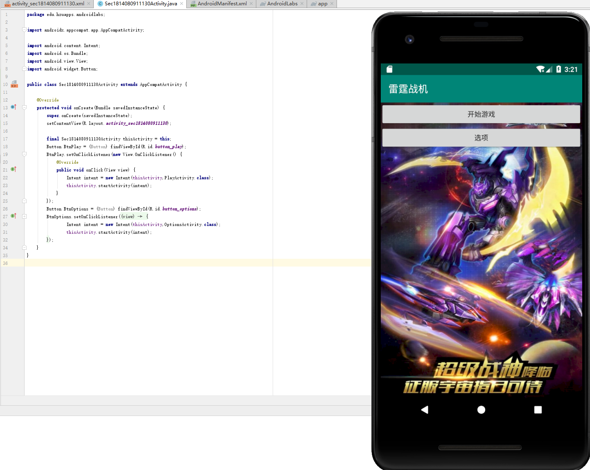

# 一、实验目标

1. 在Issues中创建自己的选题：https://github.com/hzuapps/android-labs-2020/issues；
2. 根据自选题目，编写一个或多个Activity（所有均带上学号前缀，放到自己的Java包下）；
3. 将标题设置为自己的学号+对应的功能或题目；
4. 根据自己选择的题目实现Activity中导航、调用等功能（选做）

# 二、实验内容

1. 自定义选题；
2. 根据自选题在Android Studio中创建一个或多个Activity；
3. 实现一个Activity与另一个Activity之间的跳转（显式或隐式）

# 三、实验步骤

1. 在https://github.com/hzuapps/android-labs-2020/issues下提交自选题“雷霆战机”；
2. 打开Android Studio,在java包下创建三个相关功能Activity；
- Sec1814080911130Activity.java
- PlayActivity.java
- OptionsActivity.java
3. 在Security814080911130Activity的layout文件中设置两个按钮，分别为“开始游戏”和“选项”；
4. 在Sec1814080911130Activity.java中创建按钮对象Play和Options；
5. 使用findViewById方法引用布局文件中的对应按钮，使得在写.java的按钮时能与布局文件里的一致；
6. 设置Play和Options点击事件；
7. 创建intent跳转对象，使用显式方法Intent(源Activity.this,目标Activity.class)；
8. startActivity(intent)实现点击跳转
```
public class Sec1814080911130Activity extends AppCompatActivity {

    @Override
    protected void onCreate(Bundle savedInstanceState) {
        super.onCreate(savedInstanceState);
        setContentView(R.layout.activity_sec1814080911130);

        final Sec1814080911130Activity thisActivity = this;
        Button BtnPlay = (Button) findViewById(R.id.button_play);
        BtnPlay.setOnClickListener(new View.OnClickListener() {
            @Override
            public void onClick(View view) {
                Intent intent = new Intent(thisActivity,PlayActivity.class);
                thisActivity.startActivity(intent);
            }
        });
        Button BtnOptions = (Button) findViewById(R.id.button_options);
        BtnOptions.setOnClickListener(new View.OnClickListener() {
            @Override
            public void onClick(View view) {
                Intent intent = new Intent(thisActivity,OptionsActivity.class);
                thisActivity.startActivity(intent);
            }
        });
    }
}

```

# 四、实验结果

；


# 五、实验心得

&#160; &#160; &#160; &#160;本次实验创建了选题，创建了按钮，实现了点击事件，但创建两个按钮是用同一个代码复制的，需要修改代码。
